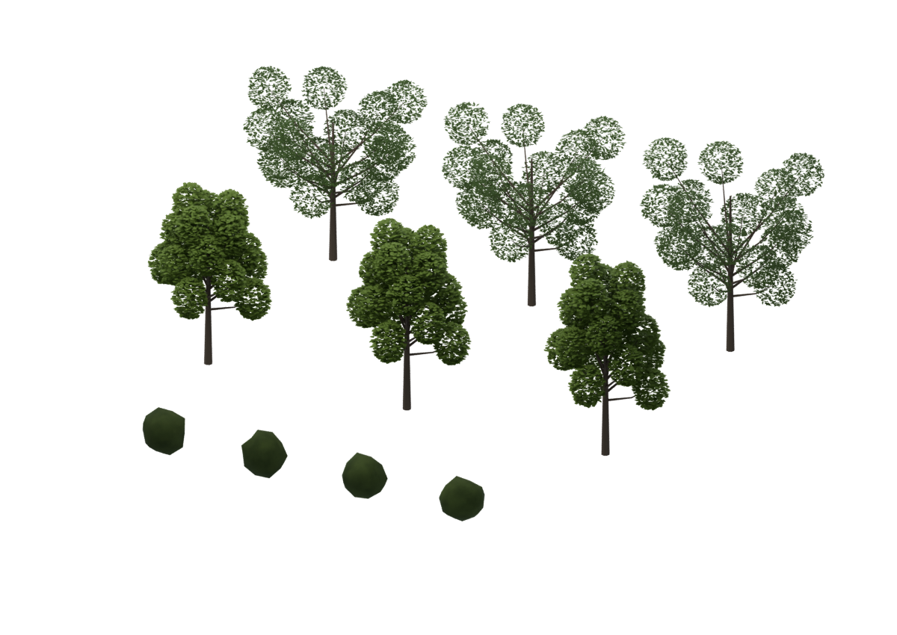

# 樹木・低木の基本形状と数式材質

イチョウ3種類・ケヤキ3種類の幹と葉（12メッシュ）、低木4メッシュ、数式材質31種を、[CC BY 4.0](ASSET-LICENSE.md)で利用できるようにしました。2026-09-27のアカウント保有者の同意と正確な対象は [provenance.json](provenance.json)、作者表示と制作元は [NOTICE.md](NOTICE.md) に記録しています。

旧都市の座標・地図・建物・集約形状・画像・旧制作コードは含みません。部品は特定の現地樹木の測量モデルではありません。



## 配布物の状態

`procedural-components-v0.1.0.zip` をローカルで作成・検証済みです。ZIPを新しいフォルダーへ展開し、Blender 4.5.1 LTSで `kit.blend` を開けます。追加アドオンや旧都市ファイルは不要です。[同梱の使い方](PACKAGE-README.md)

**公開URLは未登録です。** [配布物と検証の記録](package-v0.1.0.json)にサイズ・SHA-256・内容を固定しています。公開Releaseは[既存の順序](../../starter/plaza/releases.md)に従い、PR取り込み後のcommitを記録して作成します。今回の許諾記録をmainへの取り込み承認とは扱いません。

## 確認した内容

元候補から許諾表示と描画出力先だけを更新し、形状・smooth・変換・材質と専用カメラ・照明の設定を比較しました。別プロセスで再読み込み・描画し、ZIPのCRC・全ファイルhashを確認後、新しいフォルダーへの展開物も再読み込み・描画しました。16メッシュ・31材質は一致し、画像・library参照・埋め込みTextは0件、プレビューの全画素は元候補と同じでした。元候補は変更していません。

同じWindows PCでの検査です。別PC・他OSや、公開URLからの取得は未確認です。全都市モデルの配布は別の作業です。

## メンテナー向けの梱包

許諾対象の固定候補とプレビューを用意して実行します。これは配布用ZIPの生成手順です。受け取った方はBlenderで開くだけで利用できます。

```powershell
& 'C:\Program Files\Blender Foundation\Blender 4.5\4.5\python\bin\python.exe' scripts/package_procedural_components.py build --input data/local/candidates/procedural-components-20260927/kit.blend --preview data/local/candidates/procedural-components-20260927/preview.png --blender 'C:\Program Files\Blender Foundation\Blender 4.5\blender.exe' --output data/local/packages/procedural-components-new
```

新しい出力先を指定してください。候補のbytes/hashと許諾範囲を検査し、ZIPにはモデル・プレビュー・README・ライセンス・NOTICE・許諾台帳・検証結果・ファイル一覧の8ファイルだけを同梱します。旧blend、旧コード、ログ、未知のファイルは梱包しません。出力先の `SHA256SUMS.txt` はZIPの照合用です。自動アップロード・マージは行いません。
