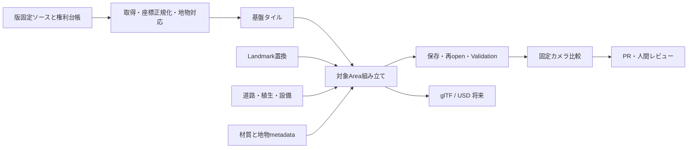

# Architecture v0.1

## 決定

まず既存blendを固定した入力として、一つのlandmarkへの変更をテキスト定義＋Pythonで再現します。都市全体の再生成はその後です。**正本は地物定義・出典・生成コード・版固定された入力資産**、blendは編集・レンダリング用の組み立て結果とします。手編集資産のみ例外として独立blendを正本にできます。

初期は既存repository内の移行branchで進め、過去commitを保全します。名称変更は移行完了後に判断します。初版資料はレビューしやすいよう別フォルダで提供しており、原本の移動・GitHub変更は実施していません。

## レイヤーと合成



合成順はterrain → base buildings → landmark replacement → infrastructure/vegetation → material overrides → review camera。Filmのカメラ・タイトル・音楽・演出は独立profileです。元データは不変とし、置換・抑制・補正を別ファイルに記録します。

Landmarkには `replaces` に元地物ID群を記載し、該当する基盤geometryだけを描画対象外にします。半径だけで周辺建物を削除しません。二重描画・隣接建物欠落をQAで検出します。PLATEAU更新時には対応地物が見つからなければ停止し、推測で別地物へ適用しません。

## Repository構成案

以下は移行先の設計であり、全ディレクトリやCLIが実装済みという意味ではありません。

```text
open-tokyo-world/
  README.md CONTRIBUTING.md LICENSE NOTICE.md AGENTS.md
  .github/
    ISSUE_TEMPLATE/reality-difference.yml
    PULL_REQUEST_TEMPLATE.md
    workflows/{metadata,render-review}.yml
  docs/{architecture,data-sources,ai-workflow,quality-guidelines,roadmap}.md
  areas/tokyo-tower/{area.json,quality.geojson,review-cameras.json}
  features/jp/tokyo/minato/{tokyo-tower,azabudai-mori-jp}.json
  sources/{datasets,claims,licenses}/
  manifests/{assets.lock.json,legacy-baseline.json}
  schemas/{feature,area,source,run}.schema.json
  blender/scenes/                   # 小さいassemblyまたは組立レシピ
  blender/assets/{landmarks,manual}/ # 正本となる独立資産のみLFS候補
  scripts/{import,generation,materials,camera,render,validation,export}/
  agents/instructions/
  issues/{templates,examples}/
  tests/fixtures/                   # 小さく権利確認済みのテスト入力
  renders/previews/                 # 採用された代表画像のみ
  data/cache/                       # Git外、hashで取得
  build/                            # Git外、組立結果
  runs/                             # Git外、実行ログと比較画像
```

GitHubがIssueフォームとして認識する配置は `.github/ISSUE_TEMPLATE/` です。`issues/templates/` は説明・例示用として残します。root AGENTS.mdは探索入口と実行手順だけを示し、詳細はagents/instructionsへ誘導します。巨大キャッシュをAgentが探索する必要はありません。

## 地物IDと変更単位

自前ID例：`otw:jp:tokyo:minato:azabudai-mori-jp`。名称、座標、旧object名はaliasとして検索可能にします。PLATEAU featureはdataset revision＋gml:id、無い場合は元resource hash＋batch IDのスコープで対応を保持します。後者を世界共通の永続IDとは扱いません。

Landmark内は `facade/north`、`crown`、`podium` 等にpart IDを付与します。Blender object/collectionには `otw_feature_id` と `otw_part_id` を付与します。大きい基盤はtile単位のまま保持でき、面・batchから地物IDへ引けるsidecarを持たせます。

同じ地物への並行変更は一つの作業ロックで直列化。隣接tile、共有material、camera、generatorが変わる場合は依存関係からレビュー対象Areaを広げます。バイナリ競合は合成で解決し、blendの自動mergeに依存しません。

## 座標と拡張

原点の初期候補は既存値 lat=35.65858, lon=139.74543。これは既存制作原点で、測量基準点と認定した値ではありません。Blenderは1 unit=1m、Z-up、X-east、Y-northとし、地物ごとに原点を勝手にずらしません。

source CRS・axis order・単位・高さdatum・変換ライブラリ版・変換パラメータをmanifestに保存。地理計算はfloat64で行い、局所原点を引いてからBlenderへ渡します。CityGMLのsrsNameを読み、JGD系をWGS84と無条件に同一視しません。ECEF→ENUでは入力の楕円体とheightを明示します。旧flat-ground補正は `legacy_visual_offset_m` として保存し、標高変換と混ぜません。

入力の既知点3点以上、建物高さ、隣接tile境界を確認してから新座標へ移します。未知の高さdatumはunknownのまま保持し、地形整合をverifiedにしません。東京全域は地理indexとtile別局所原点で管理し、一個の巨大blendに統合しません。

基盤tileは配布meshを尊重し、レビュー用のQuality Areaは別のpolygonで管理します。東京タワー、展望台から麻布台ヒルズへの視界、必要な周辺だけを初期対象とし、正確な境界は既存地物棚卸し後に確定します。Quality Area境界はgeometry切断境界ではありません。境界を跨ぐ地物は一つのownerを持ち隣接tileから参照します。

## Metadata契約

| 項目 | 内容 |
|---|---|
| feature_id / part_id / aliases | 安定ID、部位、検索名 |
| source_refs / claims | URLだけでなく「どの資料がどの寸法・形状を支えるか」 |
| published_at / observed_at / retrieved_at | 公表・観測/撮影・取得の別々の日付。不明はnull |
| last_verified / verified_by | 現実との照合日とReviewer。ファイルを開いた日で更新しない |
| model_version / generator / input_hashes | モデル版、生成コードcommit、入力のhash |
| geographic_coordinates / crs / vertical_datum | lat/lon順序、標高基準、local transform |
| accuracy / confidence | 寸法誤差が測れる場合のみ数値。形状・材質・配置・鮮度ごとの根拠付き評価 |
| generation | ai / human / mixed / imported、Agent実行ID、human修正履歴 |
| rights / attribution / redistribution | source別の許諾、表示文、配布可否 |
| replaces / dependencies | 置換地物、材質、tile、参照カメラ |
| status | imported / inferred / reviewed / verified。AIの自己採点だけでverifiedにしない |

claimは例として「建物高さ」「北面窓割り」「ガラスの色」を分けます。資料が競合したら観測日と対象部位を並べ、採用理由を記録します。推定値を資料記載値へ書き換えません。出典削除・許諾撤回に対応できるよう依存assetまで逆引き可能にします。

## 再現性とExport

実行keyはbase commit、patch commit、入力hash、toolchain、camera preset、seedから構成。手編集はasset hashと差分説明を必須とし、そのassetからの再組立を再現条件にします。旧baseline依存での再現とソースからの再生成を別の達成段階として記録します。

glTFはVR/ゲーム向けにLOD・material bake・instance・collisionを変換する配布形式、USDは階層・参照を保つ将来候補とします。いずれもCRS、feature ID、出典をsidecarに付けます。Blender固有shader・modifierがそのまま移ると仮定せず、独立viewerでgeometry・向き・材質を確認します。CityGMLへの逆変換・都市標準への適合認証は初期スコープ外です。
