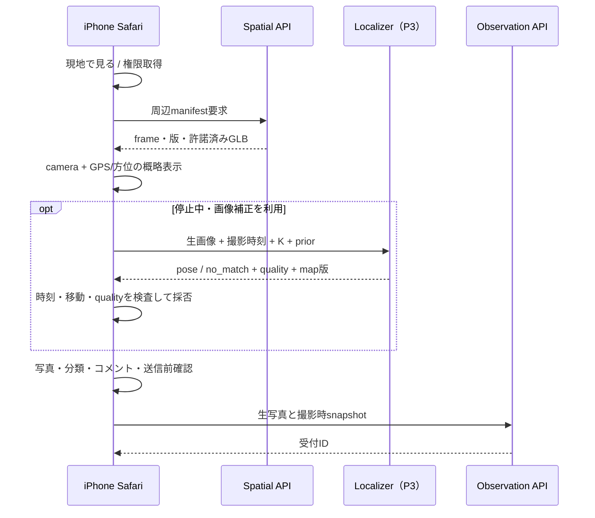

# 東京タワー Web AR / Reality Feedback 最小PoC

作成日：2026-09-07。調査・設計のみ完了。アプリ実装、配信URLの用意、現地撮影、iPhone実測は今後の作業。本書の時間は1名の開発者が入力と実機を使える場合の作業見積もりで、納期保証ではない。

**調査後の更新：** [P0実装と検証記録](web-spatial-p0-implementation.md)を追加。camera＋WebGL、位置/方位、写真下書きの端末保存は実装済み。HTTPS公開、iPhone実測、地理登録、server受付、画像補正は未実施。以下の計画・初回調査記録と、実装済み範囲を区別する。

## 一つの推奨案

**Safariのcamera + WebGLに少数GLBを重ね、GPS/方位で概略配置し、生写真をObservation APIへ保存する。続けて、同じUIから停止中の画像補正を一方式だけ試す。**

同一repo・同一URL・同一Observation contractを維持し、段階ごとに結果を判定する。初日にはセンサーと描画の成立を確かめ、VPSが未完成でも受付経路を検証できる構成にする。自動補正が不合格なら「概略表示＋報告は成立、地理固定ARは未達」と結論する。通常3D Viewerも同じURLで提供する。

## 最初の半日〜1日：Safari実機スパイク

対象は手元のiPhone 1台。`web/spatial-viewer`に独立package、camera video、透明WebGL canvas、位置/方位の診断表示、撮影previewを最小実装する。HTTPSで実機へ配信し、現地へ行く前に権限・背面camera・縦横回転・撮影を確認する。診断値は開発画面へ置き、一般利用UIにhashやmatrixを並べない。

この段階のboxやスターターGLBは**機器/描画試験用fixture**。現実に一致する東京タワーの表示成功として扱わない。serverもまだ不要で、下書きを端末へ保存して撮影情報の形を確認できる。App Store登録、WebXR、WebGPU、USDZ変換は前提にしない。

## 実地へ進む前の入力gate

| 項目 | 必要な作業 | Go / No-go |
|---|---|---|
| repo | 調査基準`31e2d3c`からの既存repo作業branch。最新mainとの変更を確認 | 既存成果と競合しない |
| asset | 東京タワーまたは50〜300m内の1〜3地物を選ぶ。既存hash・ID・sourceを引き継ぐ | 配布対象単位で許諾が明確。pendingなら公開不可 |
| 座標 | 既存原点を使い、個別のvisual offsetを監査。既知点と独立検証点で登録 | 東西南北・高さ・m単位を確認。未登録なら概略表示のみ |
| export | GLB＋feature sidecar＋固定manifestを生成 | ID往復、軸/寸法、LOD後のID、hash/bytes/出典が一致 |
| data scope | 初期100m、必要時50〜300m。少数地物のみ | 範囲外は通常Viewerへ。都市全体をDLしない |
| test users | 手元iPhoneと現地で停止できる歩道 | 撮影/位置の扱いを提示、本人の開始操作から許可 |

旧都市blendの配布状態はpendingである。**権利未解決をfixtureで隠して公開PoCを合格させない。** 解決しない場合は机上・限定アクセスの検証を先行し、公開都市表示は保留。PLATEAUの追加取得が必要なら既存catalog/ID/座標経路を使い、該当resourceの条件を確認して1地物に限定する。スターター6部品は約511m先の森JP入口なので、勝手に東京タワーへ移設しない。

## 実装順序と成果物

| 段階 | 作業目安 | 作業と残す証拠 | 判定 |
|---|---|---|---|
| P0：機器 | 0.5〜1日 | camera/GLB/センサー/生写真、API能力とpermission結果 | Safari標準設定で成立するか |
| P1：地理表示 | 1〜2日＋入力解決 | 1〜3地物export、登録transform、GPS/方位adapter、50〜300m配信 | 概略配置と誤差表示が妥当か |
| P2：Feedback | 1〜2日 | 非公開保存API、冪等再送、分類、ID候補、削除、引き継ぎ1件 | 一般利用者から運営まで届くか |
| P3：画像補正 | 2〜5日＋map準備 | 既存geometryのsynthetic map＋単画像matching/PnPをまず1方式。失敗理由を記録 | 画像補正の成立可能性 |
| P4：比較判定 | 現地半日〜1日＋集計 | 別日/別端末query、誤差と受理率、失敗例 | 続行/方式変更/保留 |

P3で実写とrenderの差が大きい場合のみ、[visual-localization.md](visual-localization.md)の実写SfMを別実験として追加する。新しい全面VPSや全国基盤を先に構築しない。計画の期間にasset権利解決、外部API契約、測位基準の準備期間は含まれない。

## 実機・現地試験

最低構成：iPhone Safari 2台（例：iPhone 13級と15以降。実際の型番/OS/Safari版を記録）、Android Chrome 1台。保持している旧iOS版と現行通常版を可能なら両方試す。beta/feature flagを必須にしない。最初のP0は1台でよく、最終判定時に比較を増やす。

東京タワー周辺で安全に停止できる5地点×2方向×3試行=30 query以上。明るい屋外を主条件とし、逆光、反射面、木の遮蔽、曇天/別日を失敗群として追加。道路を歩きながら画面注視させない。基準点は事前準備し、利用者へランドマーク枠合わせを要求しない。

| テスト | 観測項目 | 合格条件（初期目標） |
|---|---|---|
| 初回起動 | URL→初回描画、各権限 | 許可操作終了から初回camera/3Dまでp95 10秒以内、App Store不要 |
| 描画 | 初回DL、FPS、10分連続、context loss | asset合計5MB以下、median 30fps以上、p10 20fps以上、crashなし |
| 概略位置 | 既知方向と姿勢、GPS/方位値 | 四方/上下の反転なし。10秒超の古い位置を新規fix扱いしない。accuracy悪化を表示 |
| GPS/方位のみの誤差 | 基準poseに対する誤差m/deg/px | 数値を報告。精密ARの合格条件にはしない |
| 画像補正 | 受理率、位置/yaw、誤対応、遅延 | [位置推定gate](visual-localization.md)：受理率70%以上、median 3m/3°以下、baseline改善 |
| 古い結果 | request中に移動/回転/stream変更 | 時刻不一致、2秒超、並進不明な結果を現在poseへ適用しない |
| Feedback | 写真/pose/version/IDの時刻整合 | 異なる撮影のmetadata混入0。raw写真に3D overlayがない |
| 再送/失敗 | 通信断、server失敗、重複 | 同じ投稿10回の再送で受付1件、失敗を成功表示しない |
| ID候補 | 確定/曖昧/未掲載 | fixture往復100%。現地曖昧画像はunknownで保存できる |
| 運営接続 | Observation→引き継ぎ1件 | 既存ID/base/input/根拠/受入条件を揃え、変更実行前のtriageまで再現 |
| プライバシー | 不許可・削除・公開範囲 | 許可前uploadなし、private画像URLは未認証で取得不可、削除対象の参照が無効化 |

拒否ケース：cameraのみ拒否、位置のみ拒否、motionのみ拒否、全拒否、センサーnull。復帰ケース：lock、background、縦横回転、権限再許可、回線切替。SNS内browserで失敗した場合はSafariで開く導線を確認。遠隔地点では通常Viewerへ入り、現地poseを捏造しない。

計測はclient monotonic時刻とserverの受信/処理時刻を分け、p50/p95とサンプル数を残す。端末温度を直接取得できない場合は発熱の主観値・FPS低下・battery減少を記録し、取得できない数値を補完しない。測地基準がなければ3m達成と記載しない。

## 成功の判定を分ける

- **P0〜P2合格**：iPhoneでURLからcameraと3Dを表示し、現実写真とID候補/versionを保存、既存運営へ渡せる。これを最小の機能PoC成立とする。
- **P3〜P4合格**：独立queryで画像補正がbaselineを改善し、枠合わせなしで受理条件に入る。自動位置合わせの次段階へ進める。
- **画像補正不合格**：概略表示・Feedbackは残し、精密overlayの公開表現を避ける。原因をmap品質/K/時刻/特徴/geometryに分け、実写mapを試すか判断する。
- **座標/権利が未解決**：機器テストの成功のみ報告。現実のOTWモデルを重ねるPoCの完了とはしない。

## 各機能の4段階評価

「今すぐ実現可能」は標準技術で小実装できる意味であり、このrepoで既に完成した意味ではない。

| 機能 | 評価 | 理由 / 条件 |
|---|---|---|
| iPhoneへURL共有、App Store不要 | 今すぐ実現可能 | HTTPSの通常Webページ |
| カメラ + WebGLの重畳 | 今すぐ実現可能 | 権限と実機確認が必要 |
| 遠隔3D Viewer | 今すぐ実現可能 | 許諾済み軽量assetが必要 |
| GPS/方位の概略位置合わせ | 工夫すれば可能 | 軸/方位基準・欠損・誤差を処理 |
| 50〜300mのGLB配信 | 工夫すれば可能 | export/manifest/権利/容量管理を追加 |
| 写真・Observation保存 | 今すぐ実現可能 | 小さな非公開APIと保存先を実装 |
| 既存IDとの対応、AI運営への受渡し | 工夫すれば可能 | sidecarとtriage adapter、手動dispatch |
| 写真だけからの対象ID自動確定 | PoCで要検証 | 複数地物・遮蔽・pose誤差 |
| 既存geometryによる自動6DoF補正 | PoCで要検証 | 地理登録・K・実写との外観差 |
| 実写Visual Mapによる自動補正 | PoCで要検証 | map準備と独立基準が必要 |
| ユーザーの枠合わせ不要 | PoCで要検証 | 見えている範囲に十分な特徴が必要 |
| 任意iPhone/屋外で安定した歩行6DoF | 現状困難 | 最小構成に連続VIOがない |
| iPhoneの標準WebXRを主経路にする | 現状困難 | 対応を前提にできない |
| Quick Lookで単体USDZ表示 | 今すぐ実現可能 | 都市の地理整合とは別 |
| Quick Look内で自由なpose/Feedback制御 | 現状困難 | 汎用camera制御bridgeがない |
| 正確な実世界遮蔽/センチメートル級 | 現状困難 | depth・map精度・tracking不足 |
| 投稿の蓄積をVPS/再構築へ再利用 | PoCで要検証 | 同意、登録精度、汚染防止、権利 |
| 全国・完全自動3D修正 | 現状困難 | 今回の非目標、既存運営も人間review前提 |

## 今回の調査要件と文書対応

| 依頼項目 | 成果物 |
|---|---|
| 1〜6：Safari/Android/API/Quick Look/センサー | [iphone-web-ar-research.md](iphone-web-ar-research.md) |
| 7〜11：VPS、既存3D、pose、処理場所、計算/通信 | [visual-localization.md](visual-localization.md) |
| 12〜13：周辺配信・形式 | [web-spatial-viewer-architecture.md](web-spatial-viewer-architecture.md) |
| 14〜17：Observation/ID/AI/privacy | [reality-observation.md](reality-observation.md) |
| 18〜19：Architecture/成功条件 | Architecture文書と本書 |
| 20：技術リスク | [technical-risks.md](technical-risks.md) |

今回の変更は6文書のみ。既存portable unittest/compileallと相互リンク・JSON例・座標算式の検査を行う。都市形状を変えないためBlender renderは不要。今後のWeb実装ではAPI contract、軸変換、ID保持、冪等性、permission/復帰の試験を追加し、上記実機結果を別の検証記録として保存する。

### 今回の実行記録（2026-09-07）

- Python 3.12.14で`python -m unittest discover -s tests`：42件成功。
- `python -m compileall -q scripts tests`：成功。
- 6文書のローカルリンク56件、JSON例のparse、code fenceの対応、文字化け置換文字の不在を検査：成功。
- ENU→Y-upの東/北/上と逆変換、OpenCV camera軸変換、約511mのスターター距離、50m/100m先への誤差投影式を独立計算：成功。
- 未実施：Web実装、HTTPS配信、camera permission実機試験、現地座標登録、GLB export、画像localization、写真upload。上記42件は既存Pythonの回帰検査であり、Web ARの成功を示さない。
