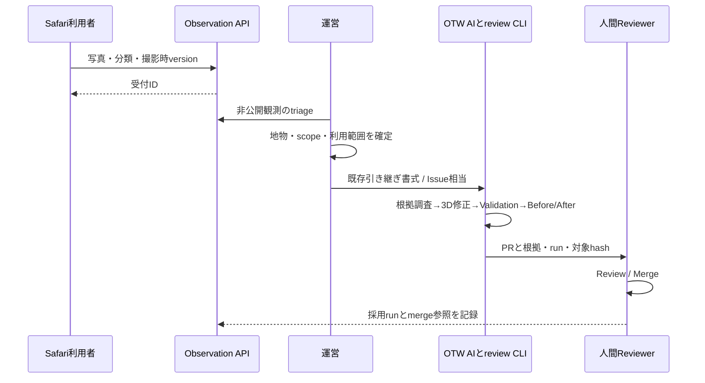

# Reality Observation データモデルと運営接続

設計日：2026-09-07。以下はv1の提案契約。現在のmainにObservation DB/APIや自動Issue変換はない。写真の保存とAIの3D修正を分離し、既存[受付ルール](contribution-policy.md)・[運営手順](maintainer-workflow.md)を再利用する。

## Observationの意味

Observationは「いつ、どこから、何を見たか」という証拠。報告者の判断、pose推定、地物候補、採用判断は別データにする。`no_issue`投稿や多数決をモデル全体のverifiedへ直結させない。同一地物の観測を蓄積できるが、建物追加の場合に既存IDを必須にしない。

UIの分類は`reality_difference / addition / outdated / digital_correction / no_issue`。撮影→分類・短いコメント→送信前preview→受付IDの順。一般ユーザーはGitHubや測地座標、model hashを入力しない。位置が拒否/不明でも、領域と任意の場所説明で保存できる。

## v1のフィールド

| フィールド | 型・必須条件 | 意味 |
|---|---|---|
| schema_version | string必須、`1.0` | unknown majorは拒否。minor追加は後方互換 |
| observation_id | server発行UUID必須 | 受付と後続処理の安定キー |
| client_submission_id | UUID必須 | 再送の冪等キー。payload hash併用 |
| observation_type / description | enum必須 / string任意・最大2,000字案 | 観測分類と本人コメント |
| captured_at / received_at | RFC3339 UTC、撮影はnull可・受信はserver必須 | 端末時刻とserver時刻を混ぜない |
| time_source / clock_uncertainty_ms | enum / numberまたはnull | device clockを真値としない |
| image | asset参照必須（写真PoC）、raw/preview別 | key、SHA-256、MIME、幅高さ、bytes、匿名化revision |
| location | objectまたはnull | latitude/longitude、altitude_m、vertical_datum、accuracy_m、altitude_accuracy_m、timestamp、provider |
| orientation | objectまたはnull | raw alpha/beta/gamma、heading、reference、screen angle、timestamp |
| camera_pose | objectまたはnull | T_area_from_camera、frame/revision、position_m、quaternion_xyzw、method、sample timestamp |
| camera_intrinsics | objectまたはnull | fx/fy/cx/cy、image dimensions、distortion、crop/rotation、calibrated/estimated/unknown |
| area_id / world_version | string必須 | 表示中の領域とrelease manifest hash。未取得時は下書きに留める |
| displayed_models | array必須、空可 | feature_id、model_version、asset hashの撮影時snapshot |
| feature_id / part_id | stringまたはnull | **確定済みの対応のみ**。既存安定ID再利用 |
| feature_candidates | array | 候補ID、method、score、根拠、使用pose revision |
| confidence | object必須 | pose/位置/ID別のmetrics・判定理由。unknownを許可 |
| device | object | browser/OS major、stream settings等。指紋化目的の詳細収集はしない |
| source_user | pseudonymous IDまたはnull | GitHubアカウント不要。公開表示名は別の任意設定 |
| consent | object必須 | 証拠保存、公開、visual map、学習の利用目的を個別に記録 |
| review_status | server enum必須 | received / needs_location / rights_review / triaged / accepted / rejected / withdrawn |
| links | server object | 関連Observation、引き継ぎ、Issue/PR/run/merge参照 |

緯度[-90,90]、経度[-180,180]、有限値、accuracy非負、quaternion norm、frame revision存在、画像サイズ・MIMEをserver検査。clientのreview_status、確定ID、権利承認をそのまま信用しない。raw入力とserver推定は別revisionで保持する。高度欠損・部位不明をゼロ/架空IDで埋めない。

### 未確定地物の例

以下は形を示す架空fixture。hash/versionの`example:`値は実APIの検証には通さない。実装時は実manifest由来の値に置き換える。

```json
{
  "schema_version": "1.0",
  "observation_id": "d388eefa-6ce0-4c7f-8f06-e07fef2aa3d9",
  "client_submission_id": "715f6775-5fd5-4b03-a572-2cf099e22557",
  "observation_type": "reality_difference",
  "description": "見えている入口の形が違うように見える",
  "captured_at": "2026-09-07T03:00:00Z",
  "received_at": "2026-09-07T03:00:02Z",
  "time_source": "device-clock",
  "clock_uncertainty_ms": null,
  "image": {
    "raw_asset_id": "example:private-image",
    "preview_asset_id": null,
    "sha256": "example:sha256",
    "mime": "image/jpeg",
    "width": 960,
    "height": 720,
    "bytes": 180000,
    "redaction_revision": null
  },
  "location": null,
  "orientation": null,
  "camera_pose": null,
  "camera_intrinsics": null,
  "area_id": "tokyo-tower",
  "world_version": "example:manifest-sha256",
  "displayed_models": [],
  "feature_id": null,
  "part_id": null,
  "feature_candidates": [],
  "confidence": {"pose": "unknown", "feature": "unknown", "reason": "sensors-unavailable"},
  "device": {"browser_family": "Safari"},
  "source_user": null,
  "consent": {"evidence_storage": true, "public_display": false, "visual_map": false, "model_training": false, "policy_revision": "poc-v1"},
  "review_status": "needs_location",
  "links": {}
}
```

## 地物IDへの対応

1. clientは表示geometryのraycastから候補を取得。GLB node/primitive/instanceのsidecarで既存`features[].id`へ解決する。
2. GPSの近傍、cameraの視錐台、推定poseからのdepth/遮蔽、画像上の対象領域を照合する。rayが複数建物に当たる・poseが粗い場合は複数候補を保持する。
3. 運営/AIは候補と写真の根拠を見て確定する。初期PoCはタップ選択を任意の補助にできるが、撮影前の手動位置合わせは要求しない。
4. 未掲載建物・対象不明は`feature_id=null`。名前や画像認識だけで東京タワー/森JPタワーへ割当しない。追加採用時にOTWのID運用で発番する。
5. PLATEAU対応はdataset revision＋gml:id、gml:idがなければresource hash＋batch IDを保持。再tile化でbatch番号が同じでも同じ地物とは見なさない。

タップは「デジタル側の選択」を示すだけで、現実写真との一致を証明しない。poseが悪い場合はcandidateのままとする。写真を複数のfeatureへ紐付ける将来の拡張はassociation tableで行い、元のObservationを複製しない。

## 保存API・再送・offline

`POST /v1/observations`をmultipart metadata+imageで実装する最小案。5MB/画像、長辺2,048px、最大decode pixel数を初期上限とする。JPEG/PNG以外や偽装MIMEは拒否。cameraからcanvasへ変換した画像を主入力とし、任意添付のHEIC対応は後続。

serverは検査済み画像を非公開object storeへ置き、DBの受付rowと参照を確定してから201とID/削除用tokenを返す。書込み失敗時は「送信完了」と表示しない。孤立objectは回収job対象。再送は同じsubmission ID＋同じhashで既存IDを返し、同じID＋異なるpayloadは409。429/503はbackoff、401/403/413は利用者が状態を理解できる表示にする。

通信切断では保存済みと偽らず「未送信」。まずメモリ下書きと端末への明示downloadを用意する。IndexedDBへの永続下書きは本人が選んだ場合のみとし、終了/削除操作と短い期限を設ける。ブラウザのstorage evictionやbackground停止があるため、自動後送を保証しない。

localization用画像は`POST /v1/localizations`で別処理。画像を照合したことをObservationの永久保存同意と扱わない。request ID、撮影時刻、frame、map revisionを返し、写真投稿時は採用したpose revisionを参照する。

## 既存AI Workflowへのadapter



最小PoCは[agent-handoff-template.md](agent-handoff-template.md)を運営が埋める。既存Issueフォームの`location`へ場所、`observation`へ分類＋コメント、`evidence`へ撮影時点と共有可能な証拠への参照を写す。非公開raw画像・詳細な位置・署名URL・個人tokenを公開Issueへ転記しない。GitHubへの自動投稿は後続のserver adapterであり、今回実装しない。

撮影時versionと修正のbase SHAを別々に記録。古い観測に対して現在のmainで既に直っていれば重複扱いにできる。adapterは`observation_id + revision`で重複起票を防ぐ。triage後は既存`reported → triaged → researching → planned → building → validating → rendering → in-review → merged`を使い、`needs-location / rights-review`などの保留も維持する。Observation受理は3D修正や採用の約束ではない。

Web入力から任意Python/URL取得を起動しない。change-planのbase/hash/対象ID/許可pathsを運営とAIが確定し、既存の限定patch adapterとreview CLIを使う。新しい種類の修正にはadapter開発が別途必要。mergeは人間が行い、受付DBにIssue/PR/run/merge/採用model versionを追記する。

## プライバシーと利用目的

以下はPoCの設計方針。運用開始前に保存先・利用規約・実装と照合する。法令適合の認定ではない。

- camera映像は基本端末内。画像補正へ送信する前に、その目的と保存期間を表示する。写真投稿、公開、Visual Map利用、model学習を別同意にし、初期値は証拠保存以外false。
- 精密位置・日時・写真は非公開。公開用は顔・車両番号・室内/住居情報等を必要に応じて除去した派生画像にする。顔の同定は行わない。自動maskは見落としがあるので公開前reviewを残す。
- EXIF等の余分な情報をstripし、必要な測位値は権限制御されたmetadataへ分離する。VPS用にはmask後画像で精度も再評価する。
- 初期保持案：localization一時画像は応答後削除（障害時も24時間以内の回収）、未採用Observation原本は30日、採用証拠は利用目的に応じ運営が期限設定。バックアップは最大30日で期限消去する案。これは実装済みの削除保証ではない。
- 削除tokenまたは認証で本人が撤回できる。raw/preview/descriptor/map/学習datasetの依存表から派生物を無効化し、必要ならmap再構築。公開済みGit履歴や第三者複製の完全回収を約束しないため、rawをGitへ入れない。
- object storeは非公開、短期signed URL、RBAC、TLS、access logの秘匿化、upload rate limitを設ける。画像decoderは制限環境で処理。任意URLのserver fetchは最小APIに含めない。

既存のsource/claim/rights方針を維持する。PLATEAUは[公式FAQ](https://www.mlit.go.jp/plateau/faq/)でもデータごとの複数licenseが示されており、各resourceの条件を確定する。[OSM](https://www.openstreetmap.org/copyright)由来のdatabaseと写真/生成モデルの条件を混同しない。公開サイトで見られる参考写真をVisual Mapやtextureへ無断転用しない。
