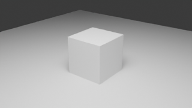
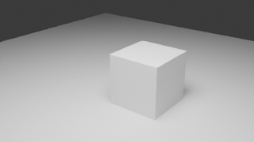

# Review harness v0.1

これはM1の技術基盤です。GitHub Issueを自動処理するサービスではなく、担当Agentがローカルで実行するCLIです。現実の建物の修正と人間の承認まで完了したM2とは区別します。

## 実装した処理

1. 外部入力blendのサイズ・SHA-256とBlenderバージョンを固定。
2. 元ファイルを変更せず、新しい実行ディレクトリへBefore／Afterを保存。
3. 指定collectionにLandmark IDを付与。旧名との対応を保持。
4. 保存した各blendを別Blender processで再openし、形状・素材・依存を検査。
5. オブジェクトのtransform、mesh、材質等の指紋を比較し、許可外の変更を停止。
6. 固定カメラ・同一設定・seedで比較画像を新規render。
7. PNGの寸法・有限値・全黒／透明、原本hash不変を検査。HTMLとJSONを生成。

`--patch`を省略するとbaseline-captureになり、形状を変更せず比較経路を確認します。テスト用の移動patchを現実の修正と表示しません。

## 要件と実行例

Python 3.12とBlender 4.5.1 LTS。runnerはPython標準ライブラリのみ、workerはBlender同梱のbpy・NumPyを使用します。CLIのPythonとBlenderのPythonは別processです。

以下の`BLENDER`は実行ファイルの絶対パスに置き換えてください。出力ディレクトリは毎回新しくし、既存の結果を上書きしません。

```sh
python -m unittest discover -s tests -v
python tests/blender_smoke.py --blender BLENDER --output build/integration-test
BLENDER --factory-startup --background --python-exit-code 1 --python tests/create_fixture.py -- build/fixture
python scripts/review.py --blender BLENDER --input build/fixture/fixture.blend --lock build/fixture/lock.json --cameras build/fixture/cameras.json --features build/fixture/features.json --patch build/fixture/patch.json --output runs/fixture-review --width 320 --height 180 --samples 4
```

Windows PowerShellでは実行ファイルのパスを引用符で囲み、直接起動する行の先頭に`&`を置きます。CLI引数の`--blender`以降は引用符で囲んだパスのみで構いません。

東京タワーの原本を持つ担当者は次のように実行します。`LEGACY_BLEND`は原本の絶対パスで、Gitには登録しません。

```sh
python scripts/review.py --blender BLENDER --input LEGACY_BLEND --lock manifests/legacy-baseline.json --cameras areas/tokyo-tower/review-cameras.json --features areas/tokyo-tower/features.json --output runs/tokyo-baseline --device OPTIX --width 640 --height 360 --samples 8 --timeout 1200
```

OptiXが使えない環境では明示的に`--device CPU`を選びます。自動的に別backendへ切り替えません。大きいシーンのCPU処理時間は保証していません。

## 出力とレビュー

`review.html`に各視点の比較画像を並べます。`run.json`に入力・カメラ・地物mapping・patch・実行コードのhashと処理時間が残ります。失敗時もrun.jsonのok=falseとログを残します。入力検査段階で失敗した場合は出力を作りません。

実行コードが未commitの場合でも、実行ファイルのhashを記録します。`code_base_commit`は作業の起点であって実行コード全体がそのcommitと一致するという意味ではありません。レビュー対象PRのheadは公開時に別途対応付けます。

生成HTMLは同じディレクトリのPNGと一緒に閲覧します。runディレクトリにはローカルパスを含むjob.jsonとログ、および大型blendがあるため、そのまま一式をGitへ追加しません。許諾済みの比較画像と必要なmetadataを選んで共有します。

## 初版の制約

- 現実との一致、画像内の対象coverage、遮蔽、4カメラの適切さは人間の確認が必要。
- 東京タワーは旧4視点にdeck-to-moriとmori-fullを加えた6候補。展望台視点には窓枠の遮蔽があり、人間の受入は未完了。
- patch adapterはtranslationと版固定のmori_shape_v1／mori_crown_v2／mori_crown_material_v1／mori_facade_v2を提供する。後者は指定feature・object・変更前mesh hashに限定され、一般的な形状編集APIではない。[最新の外装材質候補と制約](mori-facade-dark.md)を参照。
- meshの有限座標・index・UV等を確認するが、全法線、ゼロ面積、non-manifold、全modifier評価を検査するものではない。
- 材質nodeの入力とリンクを記録するが、ネストしたnode groupや全RNA属性の完全なfingerprintではない。
- 画像はサイズと先頭pixelのdecode probe。全サンプルの完全性保証ではない。動画・UDIM等は未対応として停止。
- 外部素材の内容hash、地理座標変換の精度、peak RAM／VRAM、warm-up後3回中央値は未実装。
- CIは軽量な契約テストだけ。GitHubから個人PCへ未信頼コードを自動送信しない。
- 元データの配布権は別途確認中。固定hashがあることは配布許可を意味しない。

## 2026-09-07の実行結果

契約テスト6件、Blender統合テスト2ケースが成功。統合テストは対象objectだけが移動して4組の画像ができる正常系と、画像素材欠落で明示的に失敗する異常系を含みます。映像用のcamera markerがあるfixtureで、レビューcameraの切替が優先されることも検査します。

東京タワー原本でもbaseline-captureが完了しました。元の3,299 objectを保持し、Before／Afterのobject指紋は一致、原本SHA-256も不変でした。4視点×2画像を640×360・8 samples・OptiX（RTX 3060 Ti）で新規生成しています。処理時間は保存約13秒、再openを含む検証が各約35／37秒、4視点renderが各約24／23秒でした。これは1回の測定で、warm-up後の中央値や性能保証ではありません。

旧入力に残る5つの空メッシュを検出しました。対象名・理由・入力hashをfeatures.jsonに固定し、変更対象でない場合だけ警告として保持します。新しい空メッシュやpatch対象は例外にしません。

初回の画像確認では映像用markerによるcamera上書きを発見しました。render専用processでmarkerを解除し、実際のactive cameraを検査する修正後に実データと統合テストを再実行しました。モデル本体のcamera animationは保存変更していません。

実データの画像は配布権確認前のため、このPRには同梱しません。テストfixtureは独自生成の単純図形です。

| Before（テスト用） | After（対象のみ1m移動） |
|---|---|
|  |  |

[実データの測定結果](evidence/review-baseline-run.json) / [fixture実行](evidence/review-fixture-run.json) / [統合テスト結果](evidence/review-smoke-results.json)

## 次の受入条件

実データの4画像を人間が確認し、必要ならカメラを修正する。画像ごとの出典・利用条件を特定し、配布できるbaselineを定義する。その後、根拠のある現実差分を一件選び、対応する限定patch adapterを実装してIssue→PRを通す。

## カメラ・出典調査の追加

6視点・12枚を960×540、16 samplesで再生成し検証成功。画像384件の素材使用先と出典URLの記録を抽出した。[追加調査と制約](camera-provenance-review.md)を参照。上記4視点の測定値は旧baseline実行時の記録である。
