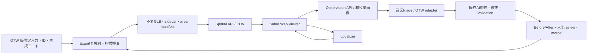

# Web Spatial Viewer / Reality Feedback Architecture

調査日：2026-09-07。対象：`OurJapan/open-tokyo-world`、調査基準main：`31e2d3c12b9986e4f40831b3392d3b2173389f32`。本書と関連5文書は調査・設計成果物であり、Webアプリ、API、VPS、実機検証は未実装・未実施。

**調査後の更新：** 同じrepo内に[P0 Web実装](../web/spatial-viewer/README.md)を追加した。camera/3D/位置・方位/写真下書き保存を実装し、[検証記録](web-spatial-p0-implementation.md)を残した。以下のAPI/VPS等は引き続き将来設計で、調査時点の「docsのみ」という記述は初回調査の範囲を示す。

## 決定

iPhone Safariでは、HTTPSページの背面カメラ映像にThree.js / WebGLの透明canvasを重ねる。GPSと端末姿勢で概略表示し、画像による補正は独立したLocalizerで検証する。WebXRはAndroid用の追加adapterに留める。利用者にランドマークを枠へ合わせさせる操作を必須にしない。初期PoCは停止して周囲を見る体験であり、歩行中の連続した6DoF追跡を保証しない。

既存repoの中に境界を作り、地物の正本・生成・人間レビューを再利用する。WebからBlenderやGitHubを直接操作させない。新規repoは作らない。判断根拠は[Safari調査](iphone-web-ar-research.md)、[位置推定](visual-localization.md)、[Observation](reality-observation.md)、[最小PoC](poc-plan.md)、[リスク](technical-risks.md)を参照。

## 既存資産監査と再利用

リンク先は調査基準commitの作業ツリー。設計文書に書かれた構成案と実ファイルを照合した。

| 項目 | 確認した根拠・状態 | 今回の再利用と不足 |
|---|---|---|
| Architecture | [architecture.md](architecture.md)：版固定入力＋地物定義＋生成コードが正本、blendは組立結果。glTF / USDは将来出力 | 配布モデルを正本化しない。exportは追加工程 |
| 座標原点 | [legacy-baseline.json](../manifests/legacy-baseline.json)：lat 35.65858 / lon 139.74543、vertical datum unknown | 同じ原点を参照し、Web用に別の無根拠な原点を作らない |
| 座標精度 | [current-state-audit.md](current-state-audit.md)：簡易換算とECEF変換が混在、建物底面を個別に約0.32mへ移動 | 旧sceneを測地ENUと同一視しない。地物別補正を監査する |
| 地物ID | [areas/tokyo-tower/features.json](../areas/tokyo-tower/features.json)：東京タワーと森JPタワーの安定ID、collection alias | `id`をAPIの`feature_id`へ写す。新ID体系を作らない |
| ID付与の実装 | [blender_worker.py](../scripts/blender_worker.py) `prepare()`：collection/objectへ`otw_feature_id`、`otw_legacy_name`付与、mapping重複を拒否 | export後もprimitive/nodeから同じIDへ逆引き。全PLATEAUの地物対応やpart ID全面実装とは扱わない |
| Asset管理 | [manifests](../manifests/)：外部blendのcommit、bytes、SHA-256、Blender版、配布状態 | 入力hash→生成commit→GLB hashの連鎖。`pending-asset-rights-review`は公開配信対象外 |
| 公開可能な部品 | [starter/plaza/provenance.json](../starter/plaza/provenance.json)、[ASSET-LICENSE.md](../starter/plaza/ASSET-LICENSE.md)：独自6部品、CC BY 4.0、推定形状 | export/ID往復の机上試験に使用可。森JP入口は原点から約511mであり、東京タワー半径300m内の実地対象に流用しない |
| AI修正 | [ai-workflow.md](ai-workflow.md)、[maintainer-workflow.md](maintainer-workflow.md)：手動dispatch、人間がscope確定・merge | Observation受付から運営者の引き継ぎへ接続。自動Issue処理サービスはまだない |
| 実行・検証 | [review-harness.md](review-harness.md)、[scripts/review.py](../scripts/review.py)：固定入力、対象外指紋、再open、同条件Before/After | 3D変更は既存CLIへ渡す。Webの写真をそのままpatchにしない |
| CI | [.github/workflows/contracts.yml](../.github/workflows/contracts.yml)：unittest / compileall | Web追加後は独立CIを追加する。現在のCIにSafari実機や座標精度の保証はない |

`features/jp/...`、汎用`schemas/*.schema.json`、地理index、汎用export、Spatial Backend、全都市のasset lockは既存Architectureの構想であり、今回確認したmainには一式の実装がない。実在する`areas/.../features.json`と`manifests/*.json`をadapterの入力にする。

## repo内の境界案

以下のディレクトリ・APIは今後の実装案。今回追加するのはdocsのみ。

```text
web/spatial-viewer/          # 独立package/lockfile、UI、camera、renderer、API client
services/spatial-api/        # 周辺manifest、Observation受付、認証/保存
services/visual-localizer/   # 画像からpose。外部VPSも同じinterface
contracts/spatial/v1/        # JSON Schema/OpenAPI、座標契約、匿名fixture
adapters/open-tokyo-world/   # 既存areas/manifests→配布manifest、受付→運営引継ぎ
scripts/export/             # Blender側の配布物生成。Web runtimeから呼ばない
```

依存方向は`viewer → versioned HTTP/JSON contracts ← API ← OTW adapter`。localizerは配布manifestとversion付きvisual mapのみ参照する。Web packageは`../../scripts`、bpy、ローカルblendパス、GitHub token、OTW内部ファイル形式をimportしない。地物IDはopaque stringとして扱う。UIからIDを分解して住所やpathを生成しない。

将来切り出す場合は`web/spatial-viewer`と公開contract fixtureを移し、API base URLだけを変更する。切り出し可能性は「Web packageとcontract fixtureだけの隔離ディレクトリでbuild・mock試験が通る」で検証する。OTW adapter、生成コード、正本は既存repoに残す。



## 座標契約

正本のlocal座標は既存方針のm、右手系、X=east、Y=north、Z=up。地理入力は名前付きlatitude/longitude（度）、ellipsoid height（mまたはnull）。JGD系sourceはsrsName、axis order、epochが分かればepochも記録し、WGS84へ無条件に読み替えない。

1. source CRS→WGS84/ECEF→局所ENUをfloat64で行う。変換ライブラリ版、パラメータ、原点高さ、vertical datumを登録する。
2. `legacy-scene`と`geodetic-enu`は別frame ID。既存原点の高さはunknown。未確認時は地理整合`unregistered`とし、仮の表示平面は推定と明記する。
3. 既知点3点以上で初期登録し、**別の検証点**で残差を測る。非共線・高さ変化を含む点を選ぶ。個別のflat-ground操作は全体の剛体変換だけで直せないため、地物別`legacy_visual_offset_m`とasset補正履歴が必要。
4. Viewerの右手系Y-upへは、登録済みENU点`(E,N,U)`を`(x,y,z)=(E,U,-N)`に変換する。変換行列は`[[1,0,0],[0,0,1],[0,-1,0]]`。東は+X、北は-Z、上は+Y。glTF exporterが軸変換済みなら二重適用しない。
5. 浮動原点は描画だけに使用し、Observationは不変のarea frameで保存。原点移動時にpose・地物選択が飛ばないことを試験する。
6. poseは`T_area_from_camera`、列ベクトル、translation m、quaternion `[x,y,z,w]`、cameraは右・上・後方(+Z)、視線-Zとする。localizerのOpenCV座標（右・下・前）から`diag(1,-1,-1)`で変換し、world→camera外部パラメータは反転してから返す。

`frame_id / frame_revision / origin / crs / vertical_datum / transform / registration_status / residuals`をsidecarへ固定。未知の高さを0という観測値で埋めず、表示用仮定を別フィールドに保存する。

## 50〜300mの配信

初期は`area_id=tokyo-tower`、一度に同じ`world_version`のmanifestとassetを取得。半径だけで削除・置換する既存geometry操作は行わない。選択は地物bounding volumeと円の交差とし、巨大な東京タワーは中心点が範囲外でも見えていれば欠落させない。遠景は任意の低LOD contextとし、取得量の上限を優先する。

| 形式 | 適性 | 決定 |
|---|---|---|
| glTF + 外部buffer/texture | 部品再利用、独立cache、HTTP requestが増える | 中期の共有texture向け |
| GLB | 少数地物を一括取得しやすい。地理index/LOD選択は別実装 | 最小PoCに採用 |
| 3D Tiles + glTF | 階層空間index、bounding volume、screen-space errorによる大規模配信 | 地物/範囲が増えた段階。GLBと排他的ではない |
| USDZ | Quick Look用の配布物 | 任意の単体プレビュー。主経路外 |

形式の役割は[Khronos glTF](https://www.khronos.org/gltf/)と[OGC 3D Tiles](https://www.ogc.org/standards/3dtiles/)に基づく。PLATEAUの既存b3dmを使う際は親子transform、RTC、軸変換、batch IDを保持する。LOD簡略化で地物境界をまたぐ結合を避け、`asset hash + node/primitive/instance → feature_id / part_id`のsidecarを検査する。対応のない面はunknownとする。

API案：

- `GET /v1/areas/tokyo-tower/manifest?radius_m=100&lat=...&lon=...`：半径はserver側で50〜300mに制限。scope外は明示する。精密位置queryをアクセスログに残さない。
- manifest：`schema_version, area_id, world_version, frame, assets[]`。assetに`url, sha256, bytes, bbox, lod, feature_ids, model_version, provenance, redistribution`。`world_version`はrelease manifest hash、`model_version`は生成commit＋入力/出力hashへの参照とし、既存モデル版を置き換えない。
- 不変asset URLはhash付き長期cache。manifestの更新は短期cache。取得途中のrelease変更では古い一式を維持し、欠損やhash不一致を最新版扱いしない。
- 0〜50mを高、50〜150mを中、150〜300mを低LODの初期案とし、画面占有率・容量上限・ヒステリシスで調整。PLATEAUの意味論上のLODと配信用簡略化段階を別名で保持する。

初回圧縮asset合計5MB以下、表示対象10万三角形以下、draw call 100以下を**目標値**とする。textureは初期1K、不要meshをdisposeし、camera映像を含むメモリ/熱を実機測定する。decode前のbytes上限とdecode後のgeometry/texture上限は別々に検査する。

## 受付と更新

Observation APIは一回の写真と撮影時のversionを原子的に記録し、受付IDを返す。画像保存・再送・匿名化は[データ設計](reality-observation.md)に従う。未実装の自動更新を装わず、PoCでは運営者が一件の引き継ぎを作る。人間merge後、exportを再生成してmanifestを更新し、過去Observationの撮影時versionは変えない。
