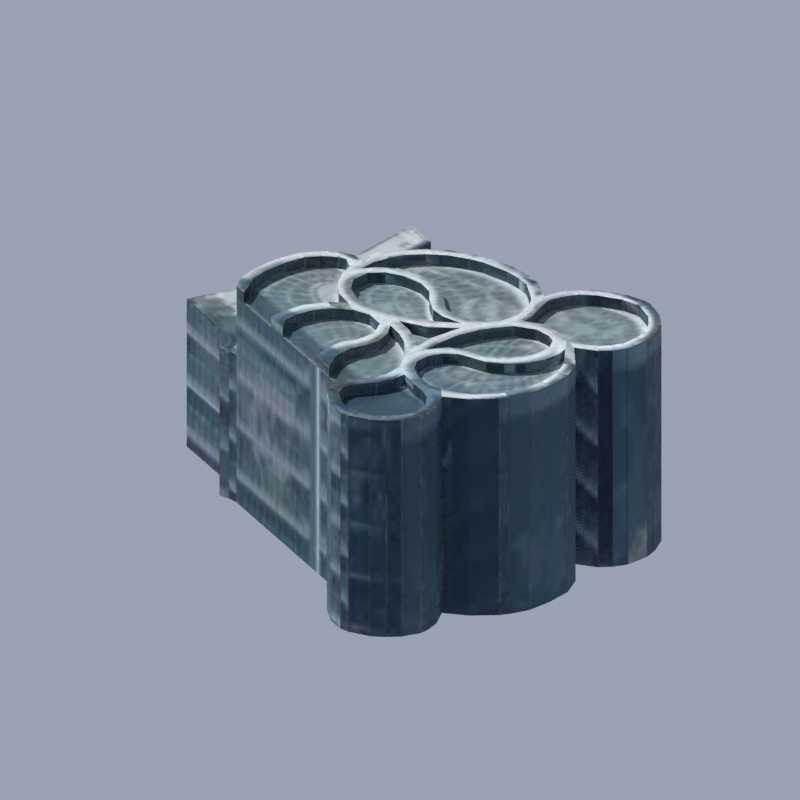
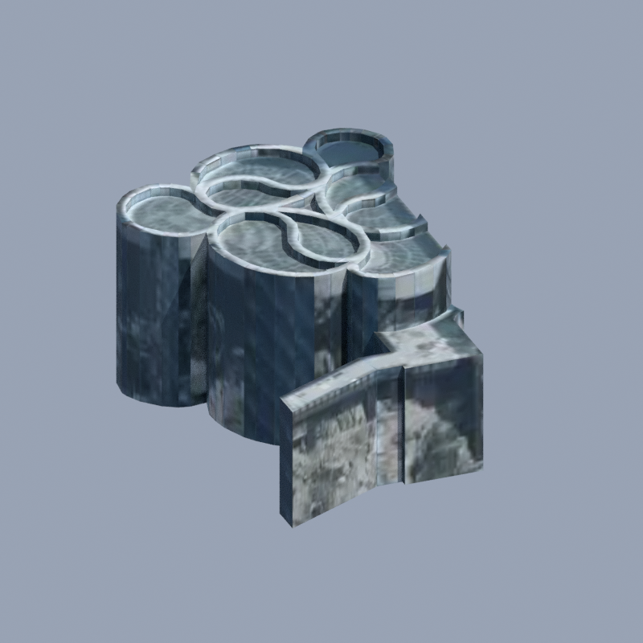
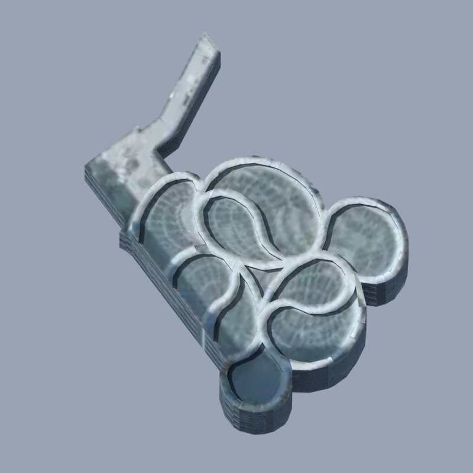
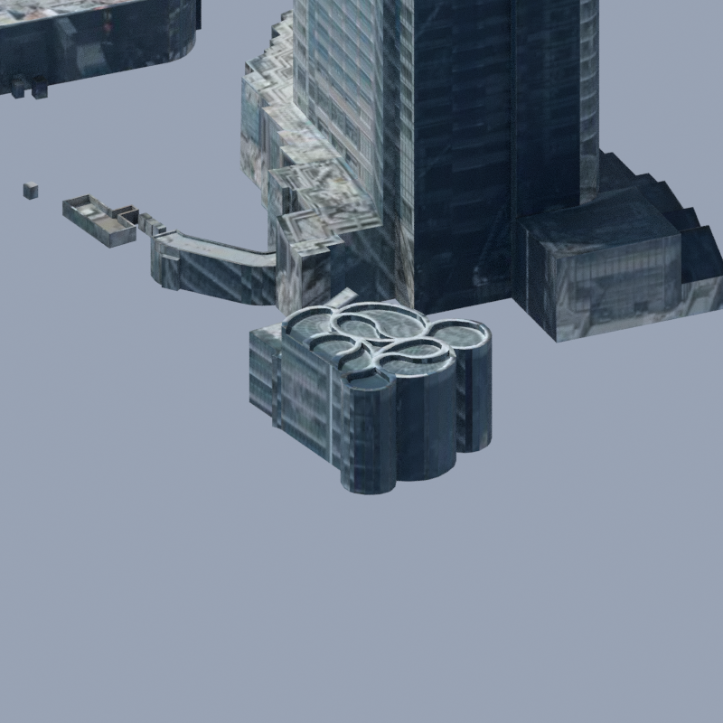

# data221 batch 0：外観保持の比較

`bldg_0551e688-a2a3-498e-ad2f-09ed3aca361c` を個別編集できる1オブジェクトへ分離し、完全同座標の頂点を共有した。2,838 → 475頂点、946面を保持。[変更と再現手順](../../../docs/data221-0551e688-topology.md) / [最新main上の検証記録](../../../docs/data221-0551e688-main-validation.json)。

固定入力から最新main `3b1eb5f` 上で新規生成したBefore/After。Blender 4.5.1 LTS、Cycles CPU 2 threads、800×800、16 samples、seed 0。同一カメラ・照明・表示設定で、4組すべてのデコード画素が一致する。外観改善ではなく、外観を維持した編集構造の改善を示す。南・北・屋根は対象を単独表示し、contextはdata221の周辺23地物を含むシーンから描画した。全都市・道路・PR #51の植栽を合成した画像ではない。

| 視点 | Before | After |
|---|---|---|
| 南 |  |  |
| 北 |  |  |
| 屋根 |  |  |
| 周辺 |  |  |

8枚を目視確認し、屋根の曲線、外壁、張り出し部分、隣接建物の見え方を保持した。現実との一致や自己交差の不在を証明する画像ではない。既存のぼけたテクスチャと合成外壁表現も維持している。

出典：3D都市モデル（Project PLATEAU）港区（2025年度）を解析・加工して作成（OurJapan）。固定タイル、旧表示互換の高さ処理、元テクスチャとDraco復号の条件は [PLATEAU NOTICE](../../../starter/plateau/NOTICE.md)、旧制作物の扱いは [NOTICE](../../../NOTICE.md) を参照。コード・画像・素材を一括でMITやCC BYとするものではない。

この8枚のPNGはユーザーが明示承認したDraft PRのレビュー証拠として公開する。元blend、モデル素材、b3dm、テクスチャは同梱せず、新しい素材配布権を主張しない。各PNGは1MB未満で、hashと正確なサイズは検証JSONに記録する。
