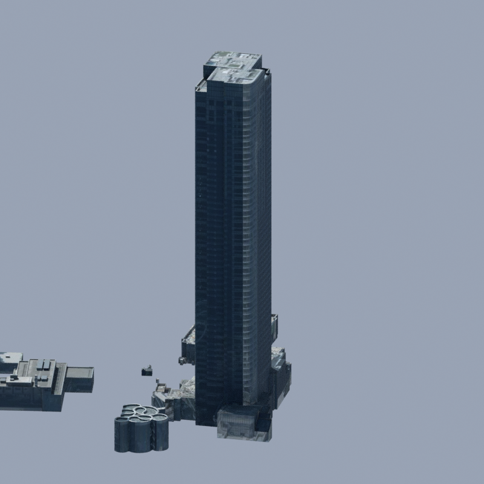
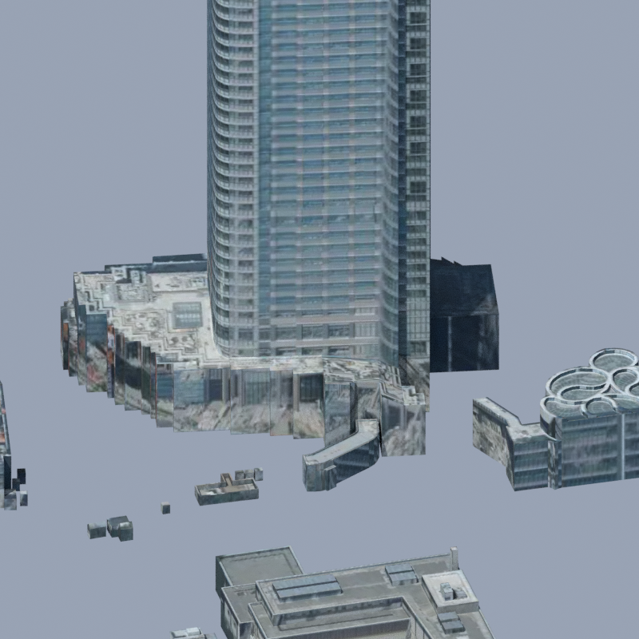

# data221: one editable building, unchanged exterior

The selected building is `bldg_af7335da-7542-44dd-964d-8cccd2b046ff`, official building ID `13103-bldg-7517`. Its 466 source triangles retain every position, face winding, UV and material assignment. Exact-position welding reduces its vertices from 1,398 to 235 and separates it from the other 22 buildings for selection by `gml_id`.

These Before/After images verify appearance preservation. They do not show a new facade or a real-world detail improvement. Both pairs have identical decoded pixels.

## Whole building

| Before | After |
| --- | --- |
|  |  |

## Podium and nearby buildings

| Before | After |
| --- | --- |
|  |  |

All four local views were inspected. These two representative pairs use Blender 4.5.1 LTS, Cycles CPU, 2 threads, 800×800, 16 samples, seed 0, and matched camera/lighting settings. Only the 23 retained data221 building features are shown. Roads, legacy reference photos, music, the detailed Mori replacement and Tokyo Tower are not included.

[Model scope and reproduction](../../../docs/data221-af7335da-topology.md) / [ID-selection and additional checks](../../../docs/data221-af7335da-integration.md) / [image hashes and source/privacy audit](../../../docs/data221-af7335da-publication.json).

## Sources, processing and publication scope

Source: [3D city model (Project PLATEAU), Minato-ku, FY2025](https://www.geospatial.jp/ckan/dataset/plateau-13103-minato-ku-2025), processed and rendered by OurJapan. The [individual resource](https://www.geospatial.jp/ckan/dataset/plateau-13103-minato-ku-2025/resource/08755b94-7b2e-4c9c-bf35-6c4d0768a463) and [PLATEAU site policy](https://www.mlit.go.jp/plateau/site-policy/) retain their source conditions. These processed comparison images are not official PLATEAU outputs. See the [retained input notice](../../../starter/plateau/NOTICE.md).

Processing includes the fixed b3dm import, ECEF/ENU conversion, legacy per-building ground shift to 0.32m, the existing source texture/UV and procedural material, exact-position vertex welding, and the comparison camera/lighting. The single packed image in this extraction matches the official tile's embedded WebP bytes (SHA-256 recorded in the audit). Existing synthetic material nodes are retained without a new material license grant; source material and legacy display-height limitations remain.

The account holder authorized publication of this change and representative comparison images with a draft PR on 2026-10-02. This is selected review evidence, with no new blanket asset or code license. [LICENSE](../../../LICENSE.md) and [NOTICE](../../../NOTICE.md) retain their existing scope. Large `.blend` files, raw textures, private logs and local inputs are not published.

PNG text/EXIF and other non-display metadata were removed. Compressed pixel data and display/color chunks are unchanged from the inspected local renders. Private execution paths are not included.
