# フットタウンの比較画像

同じカメラと照明で描画した変更前・変更後です。主正面、南側の出入口、屋上中央棟を確認できます。寸法と配置には推定を含みます。

| 視点 | 変更前 | 変更後 |
|---|---|---|
| 正面全景 | [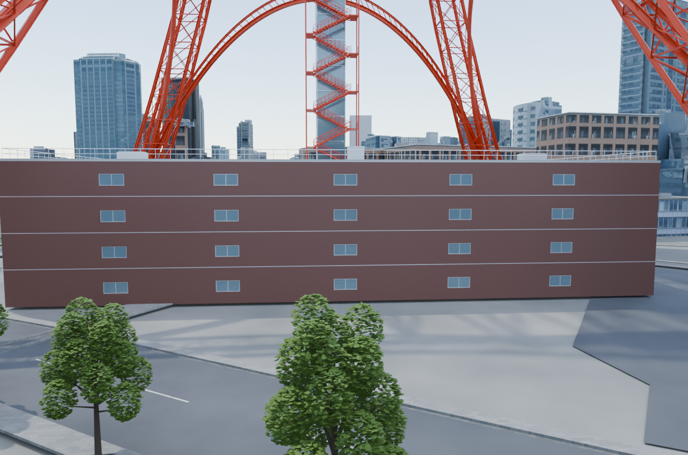](before-foottown-front.png) | [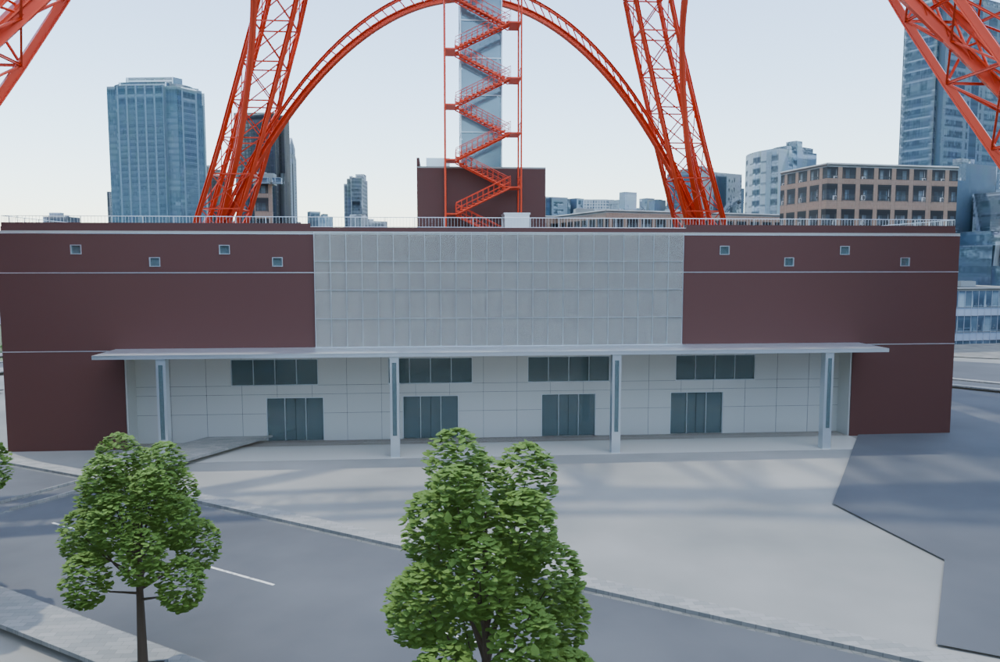](after-foottown-front.png) |
| 庇と入口の近接 | [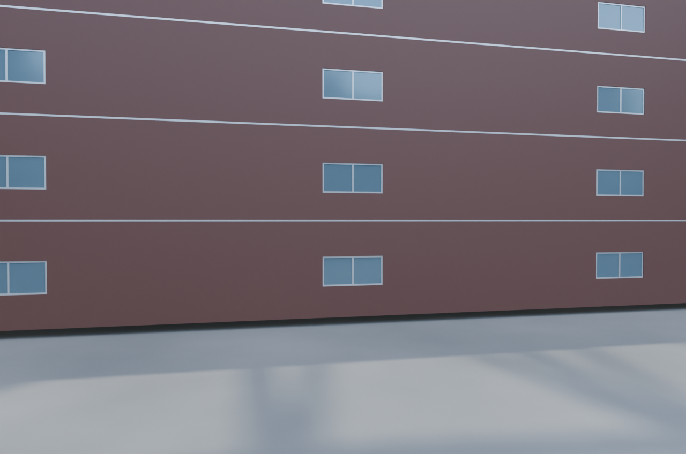](before-foottown-entrance.png) | [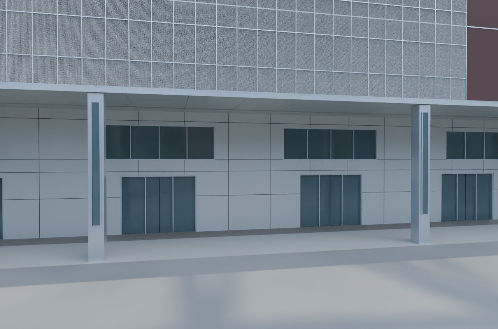](after-foottown-entrance.png) |
| 塔脚と建物 | [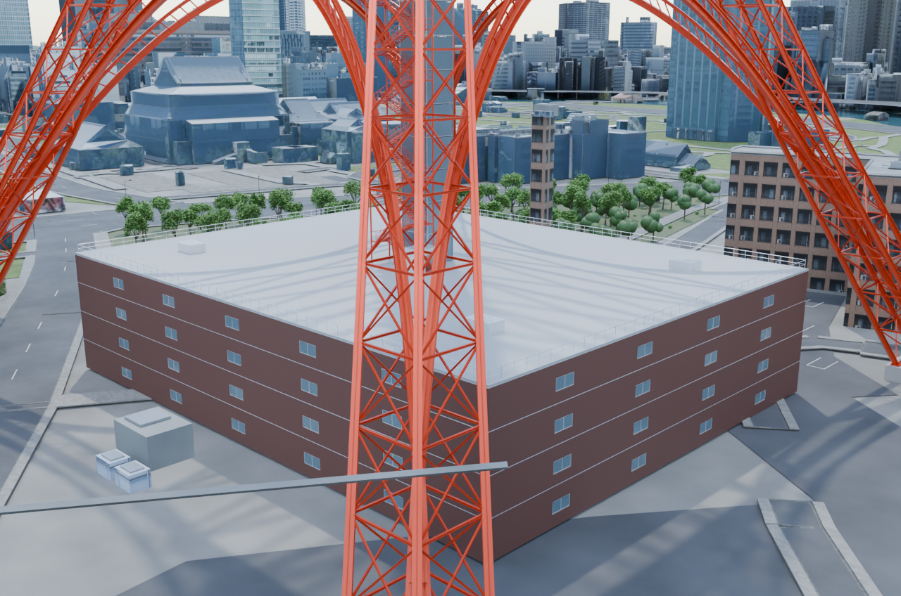](before-foottown-context.png) | [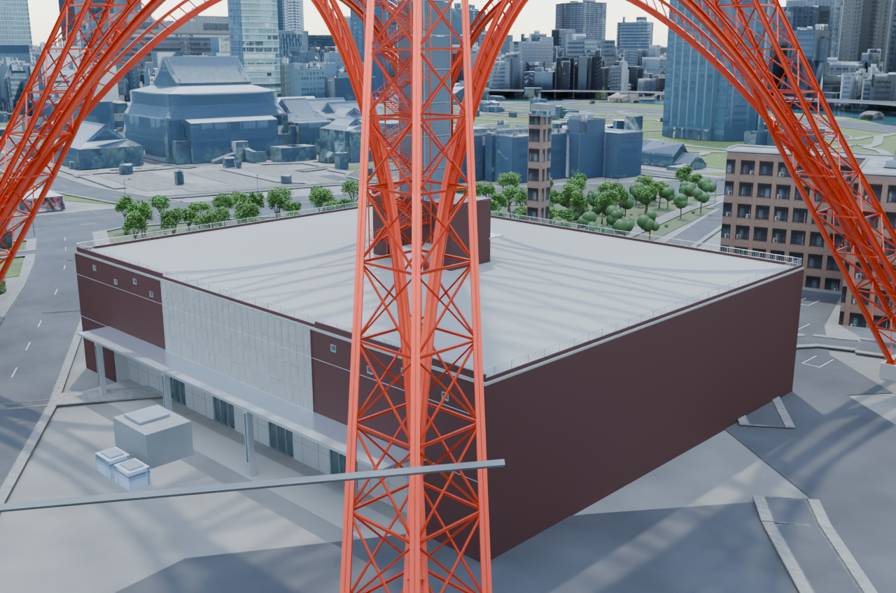](after-foottown-context.png) |
| 南側の出入口とダクト | [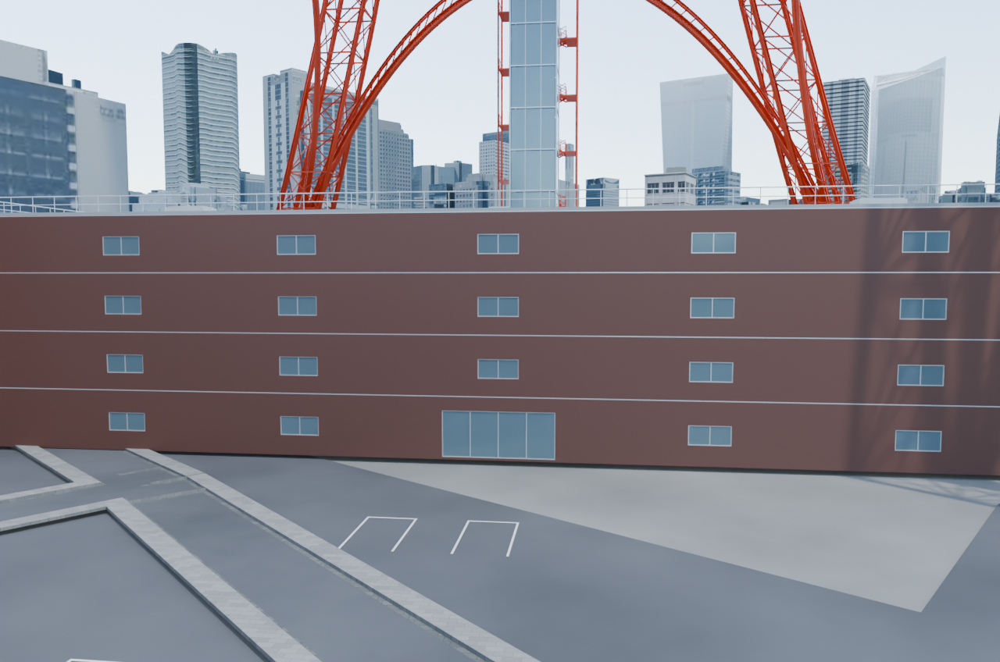](before-foottown-south.png) | [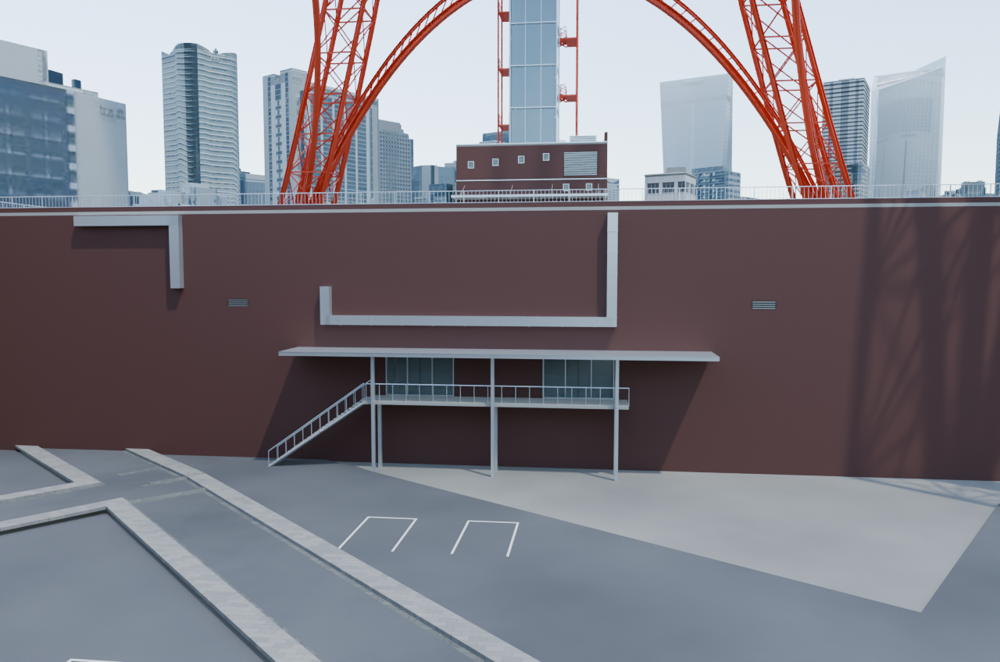](after-foottown-south.png) |
| 屋上全体 | [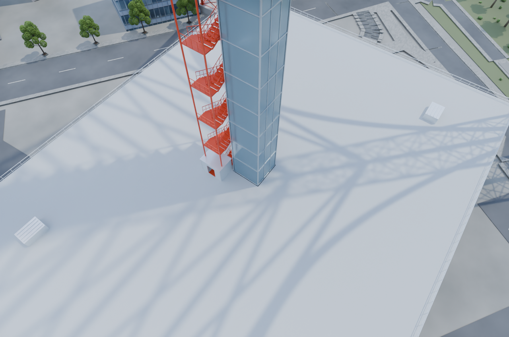](before-foottown-roof.png) | [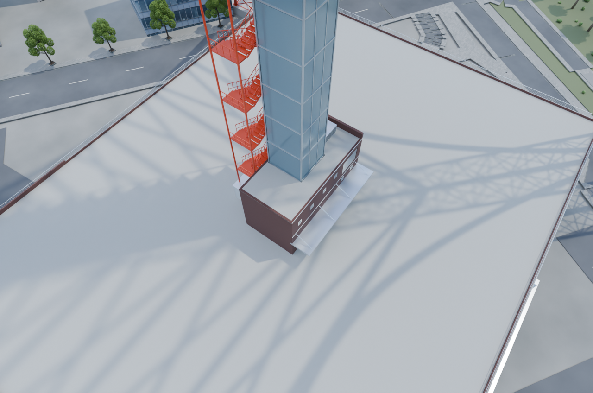](after-foottown-roof.png) |
| 屋上中央棟 | [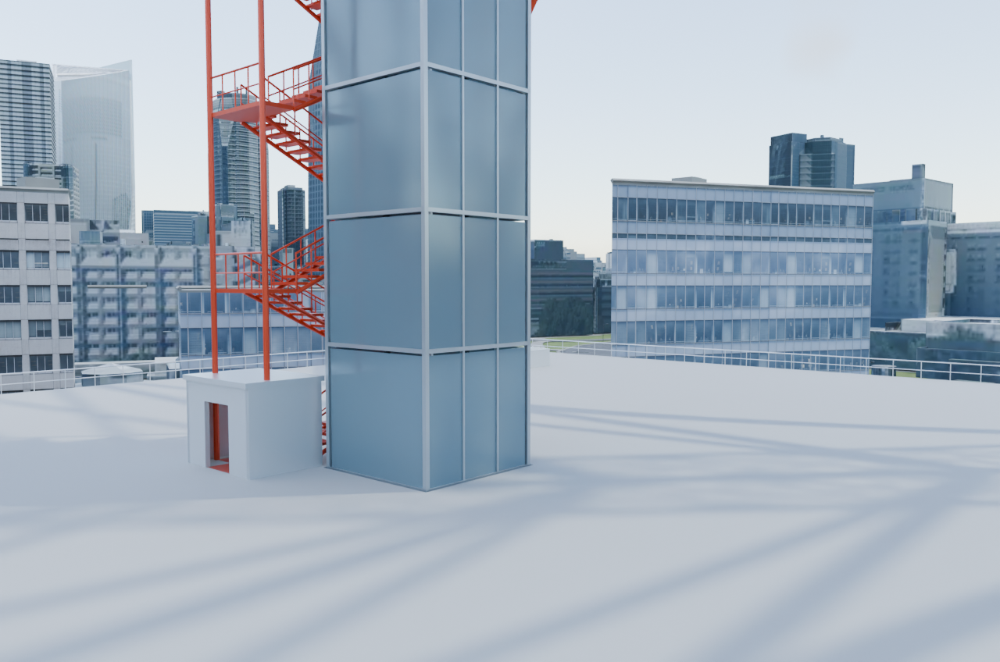](before-foottown-roof-core.png) | [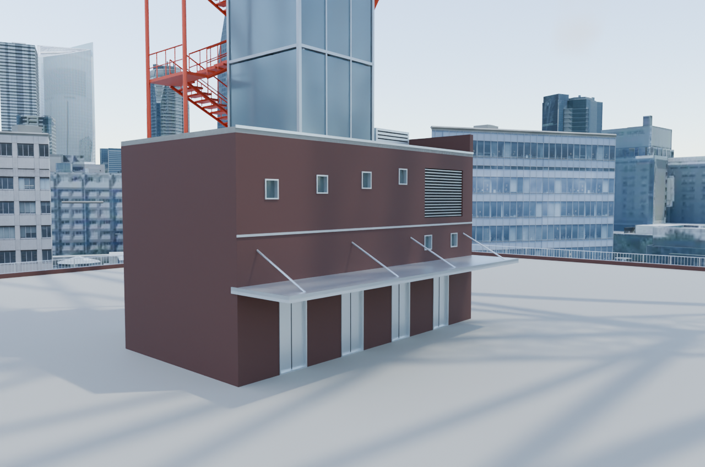](after-foottown-roof-core.png) |
| 屋外階段への通路 | [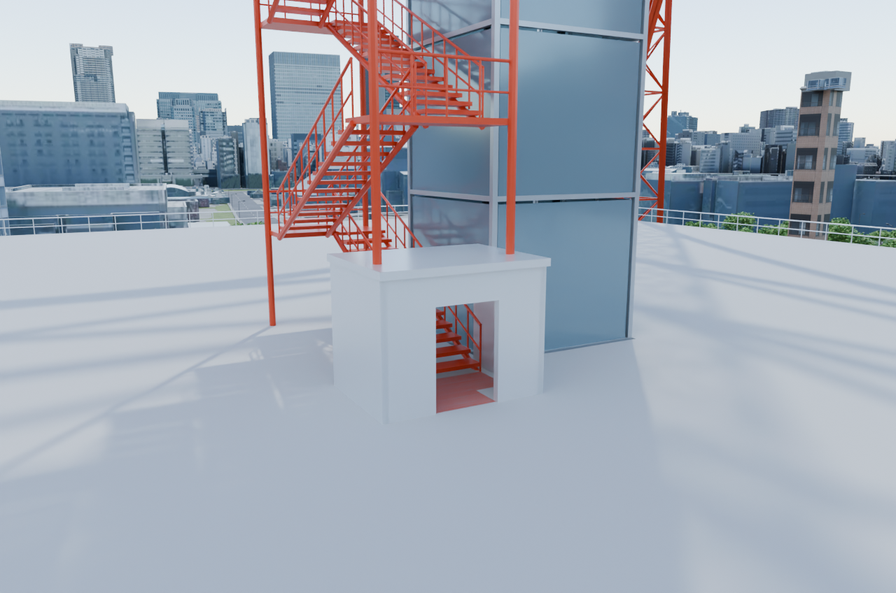](before-foottown-roof-access.png) | [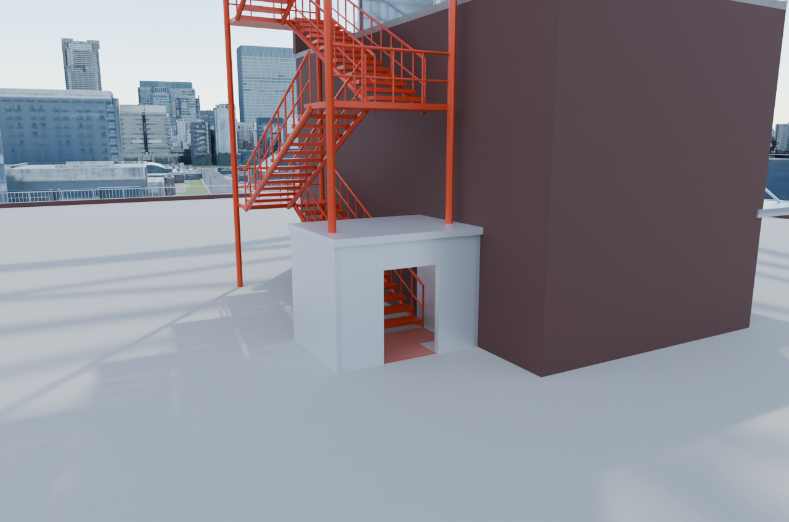](after-foottown-roof-access.png) |
| 塔全体 |  | [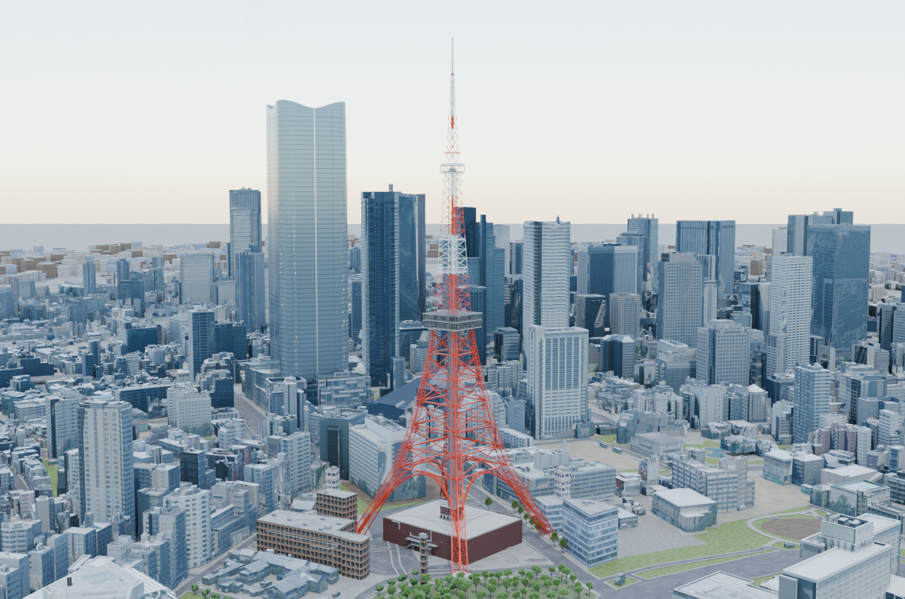](after-tower-context.png) |

Blender 4.5.1 LTS、OptiX、1280×848、32 samples、seed 0。8視点16枚。実装・描画時のcommitは `ba72fa0f471013db3836fd50b9719c84d1f7ae74` です。PNGのテキストmetadataだけを除去し、画像の圧縮データと復号後の画素を保持しています。

[変更内容と推定箇所](../../../docs/foottown-v2.md) / [保存後の検証](../../../docs/foottown-v2-validation.json) / [画像・コードのhash](evidence.json)。人間による採用判断は未完了です。

## 出典・利用条件

- 既存都市の地図由来部分：© [OpenStreetMap contributors](https://www.openstreetmap.org/copyright)、[ODbL 1.0](https://opendatacommons.org/licenses/odbl/1-0/)。
- 建物・画像には国土交通省 Project PLATEAU由来の加工データ、独自部品にはark4ez / OurJapanの制作物を含みます。[NOTICE](../../../NOTICE.md)、[都市の出典表示案](../../../sources/city-distribution-NOTICE.draft.md)、[個別ライセンス](../../../LICENSE.md)を参照してください。
- [写真・公式案内の資料台帳](../../../areas/tokyo-tower/foottown-v2-sources.json)。参考写真・PDFの画像への貼り込み、テクスチャ転用、原本同梱はありません。

公開対象はPRレビュー用の比較PNG16枚と説明・検証metadataです。都市blend・素材原本の配布や、画像全体へのMIT／CC BY等の一括許諾を意味しません。第三者素材の条件と既存の確認中事項を保持します。
