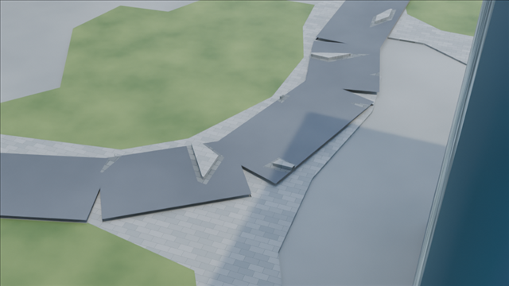
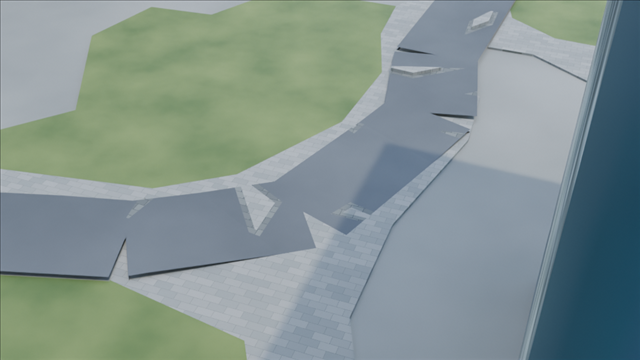
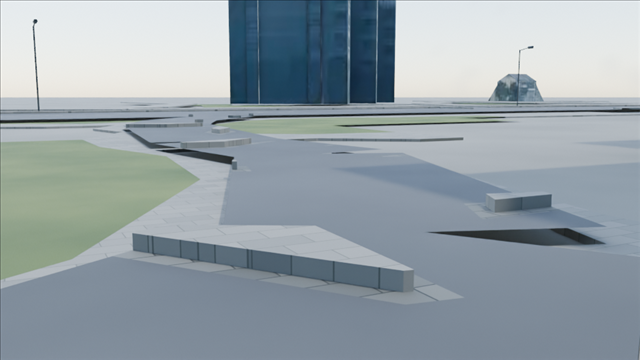
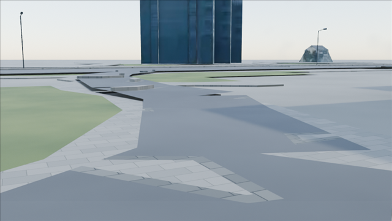
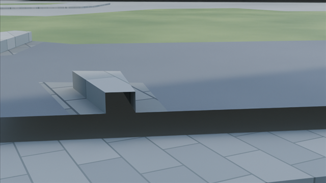
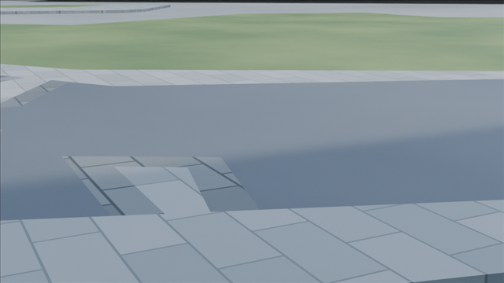
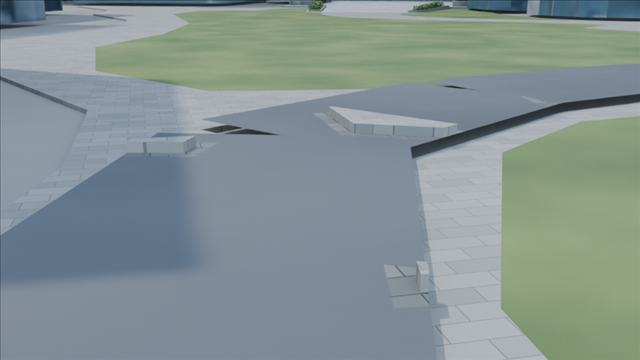
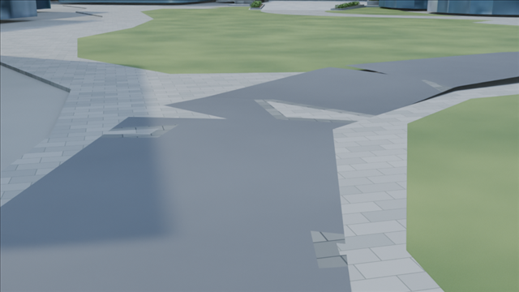

# 森JP広場・園路北東曲がり角の比較

最新 main に整合させたコードで、PR #47・#51を含む固定都市モデルを再生成・保存・再読込して描画しました。Before/Afterは同一カメラ・照明・色管理、Blender 4.5.1 LTS / Cycles OptiX / 960×540 / 16 samples / seed 0 / frame 1です。公開PNGは同じ範囲を640×360へ縮小し、文字・EXIFメタデータを除いています。

描画範囲は対象を囲む190m四方の抽出モデルです。全都市の保存済み候補は別にローカルで保持しています。

## 周辺を含む俯瞰

| Before | After |
|---|---|
|  |  |

## 園路を歩く視点

| Before | After |
|---|---|
|  |  |

## 舗装境界の低い視点

| Before | After |
|---|---|
|  |  |

## 反対側からの視点

| Before | After |
|---|---|
|  |  |

高さ・勾配はモデル内の暫定値です。現地の測量結果やバリアフリー適合を示すものではありません。[変更・再現手順](../../../docs/mori-plaza-east-bend-v1.md) / [入力・コード・画像hashと検証結果](../../../docs/mori-plaza-east-bend-main-validation.json)。

## 出典と公開範囲

ユーザーが承認したDraft PRのレビュー証拠として8枚を公開します。blend、テクスチャ、OSM原本、元の地物データは含めません。PNGの公開は元都市・第三者素材の新しい再配布許諾を意味しません。

園路のXY根拠：© [OpenStreetMap contributors](https://www.openstreetmap.org/copyright)（ODbL）、固定way `1443867478`。周辺建物等は[PLATEAU NOTICE](../../../starter/plateau/NOTICE.md)、独自の森JP追加部分は[出典・許諾](../../../starter/mori/provenance.json)、植生は[prototype NOTICE](../../../assets/procedural-components/NOTICE.md)を参照。独自部分の作者表示：ark4ez / OurJapan。[リポジトリNOTICE](../../../NOTICE.md)と[ファイル別ライセンス範囲](../../../LICENSE.md)を保持します。
