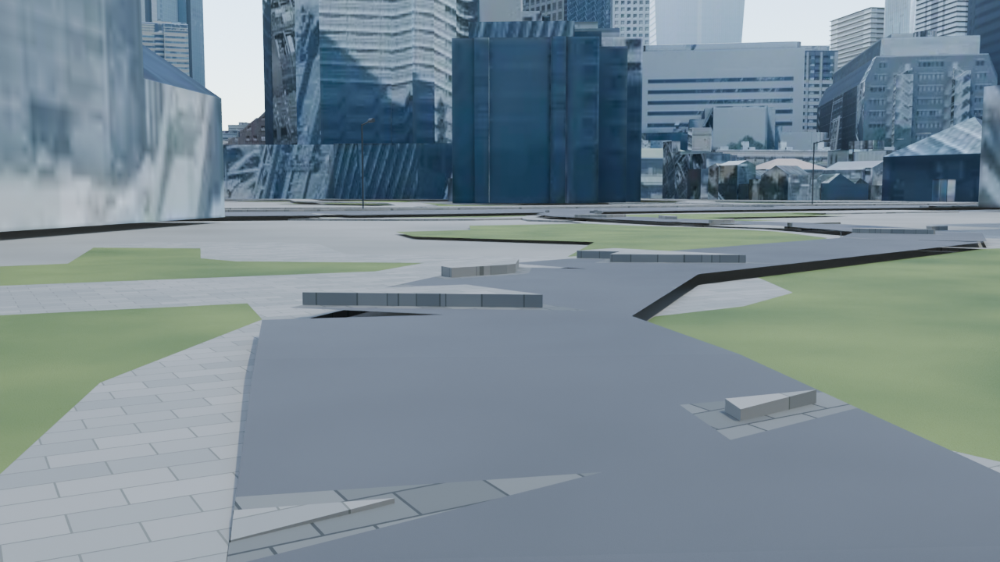
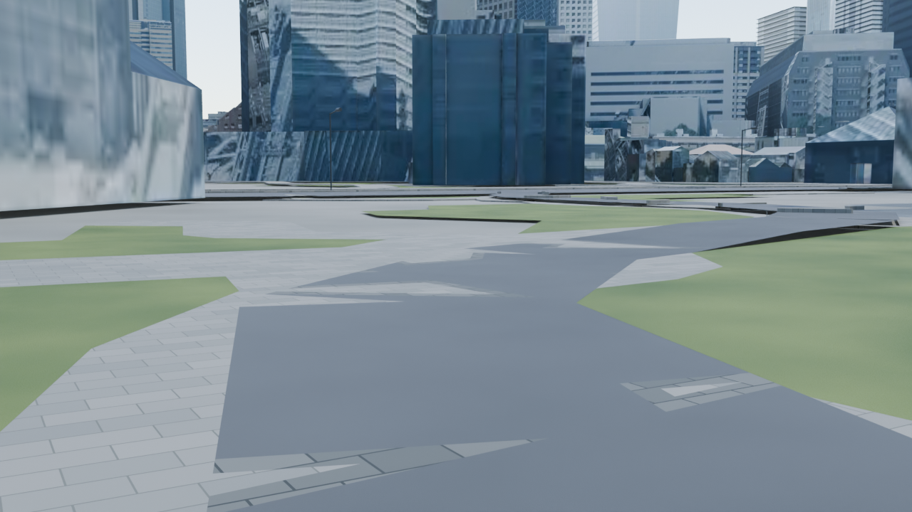
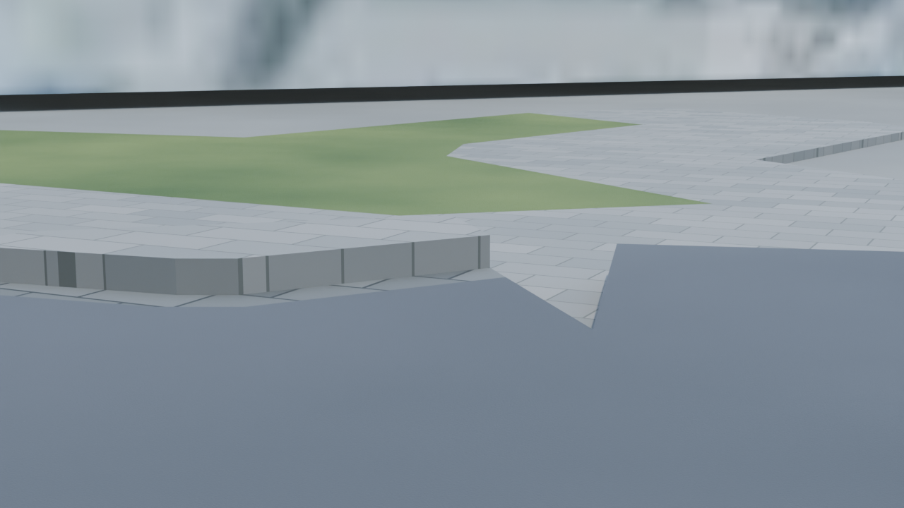
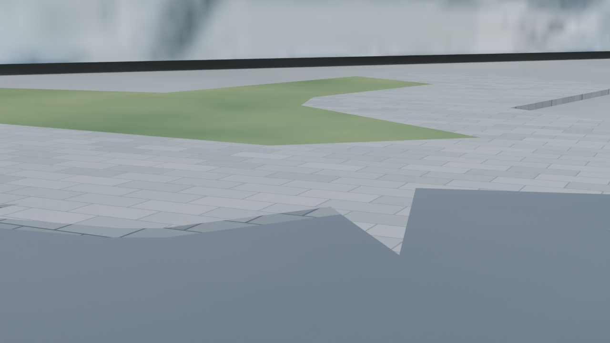

# Mori plaza west footway comparison

These four selected PNGs publish the walking and boundary views from the six-view local review. Before and After use the same fixed cameras, Blender 4.5.1 LTS, Cycles OPTIX, 1280×720 pixels, 24 samples, seed 0 and frame 1.

The west footway is lowered to the adopted 0.11m plaza height inside the declared flat core, with a bounded transition to inherited road heights. The maximum modeled step at 75 selected contact pairs changes from approximately 35cm to less than 0.001mm. All 90 probes that previously hit ground through inherited calculation gaps are covered in the final saved candidate. These are model-space checks, not measured site elevations.

## Walking view

| Before | After |
| --- | --- |
|  |  |

## Boundary close-up

| Before | After |
| --- | --- |
|  |  |

The inherited road material and XY outline remain visible. Raised inherited surfaces remain beyond the bounded north transition and in other streets. All six views, including the entrance, plaza and protected street context, were inspected locally; human review and adoption remain pending.

[Scope and reproduction](../../../docs/mori-plaza-west-path-v1.md) / [saved-scene checks](../../../docs/mori-plaza-west-path-v1-validation.json) / [image hashes, privacy and provenance](../../../docs/mori-plaza-west-path-v1-evidence.json).

## Publication and source notices

The account holder explicitly approved publishing the current change and selected comparison images with a draft PR on 2026-10-02. This directory contains selected review evidence. Legacy scenes, recovered map/road inputs, textures and other third-party content retain the existing rights and redistribution limits in [LICENSE](../../../LICENSE.md) and [NOTICE](../../../NOTICE.md). No additional asset license is granted by publishing these previews.

The path context uses fixed OpenStreetMap XY: © [OpenStreetMap contributors](https://www.openstreetmap.org/copyright), under its existing attribution and ODbL terms. Inherited building placement and other scene inputs retain the notices in NOTICE. The 0.11m plane is provisional model-space grading; surveyed elevation and accessibility are unverified.

Automatic PNG text/EXIF metadata was removed for publication. The image and colour chunks, including all compressed pixel data, are unchanged from the inspected local renders. The four PNGs total approximately 4.38MB. Large blend files, packed textures, detailed road geometry, local plans and private execution logs remain local.
