# 東京タワー周辺の道路・歩道の仕上げ比較

同じカメラ・照明・描画設定による7視点・14枚です。車道の粒感と色、歩道・側溝の目地、既存白線の粗さを調整しました。道路幅、段差、輪郭、白線の位置は維持しています。通常の交通非表示を維持した比較です。仕上げの材質・寸法は制作上の近似です。

| 視点 | 変更前 | 変更後 |
|---|---|---|
| 舗装の粒感（近接） | [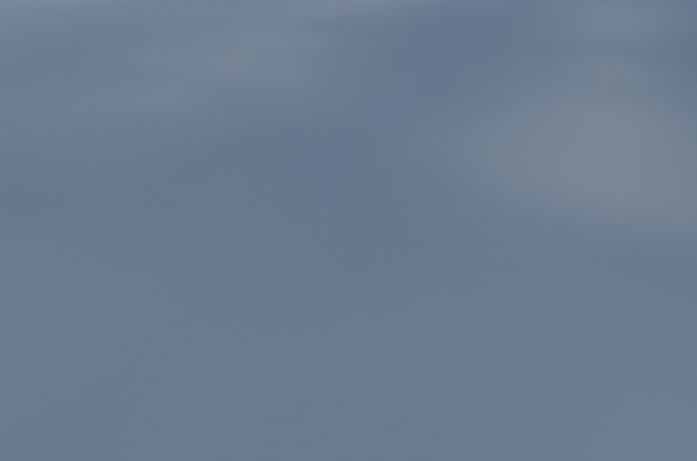](before-pavement-surface-close.png) | [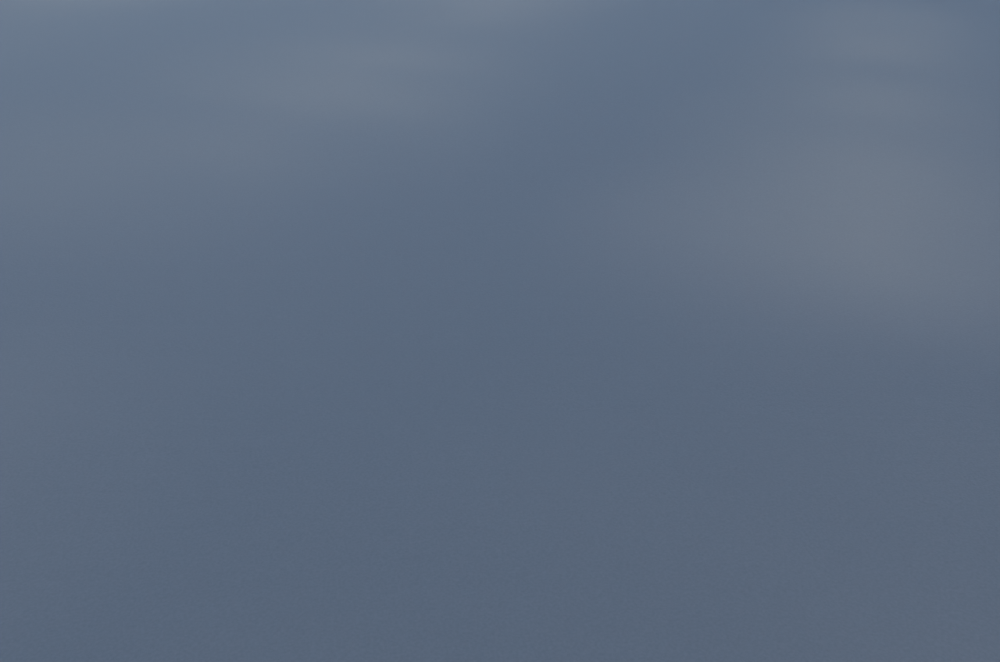](after-pavement-surface-close.png) |
| 正面と歩道 | [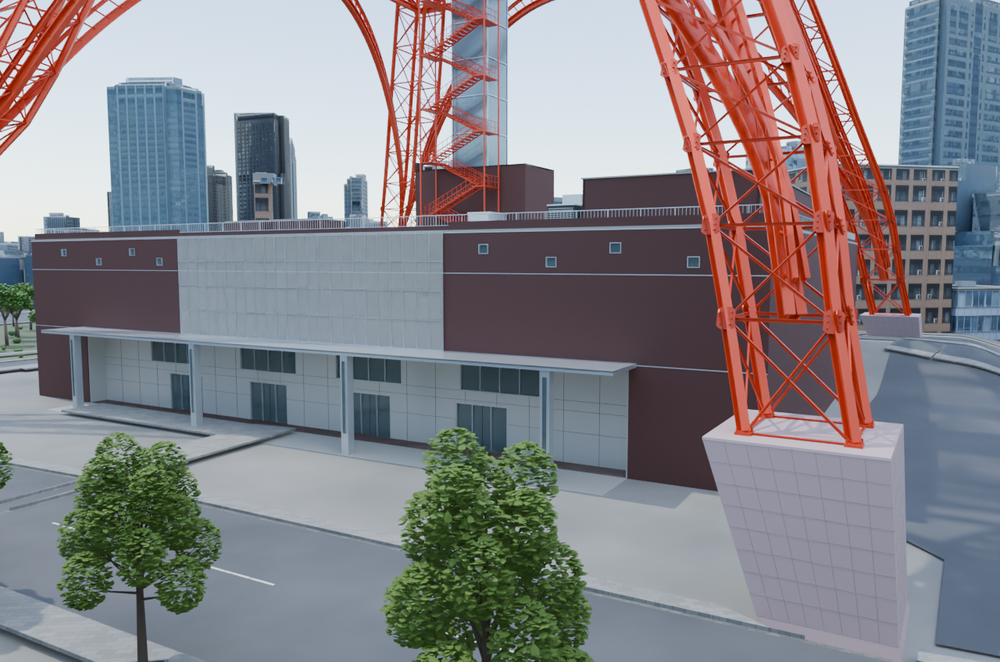](before-foottown-front.png) | [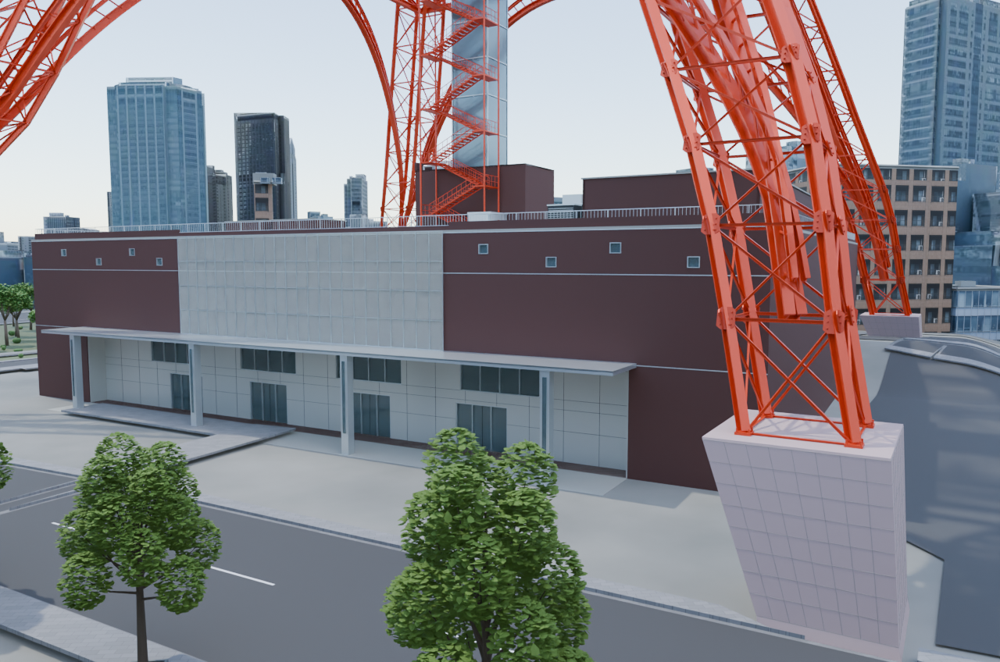](after-foottown-front.png) |
| タワー全景 | [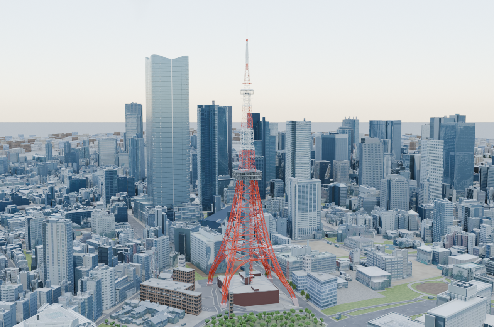](before-tower-context.png) | [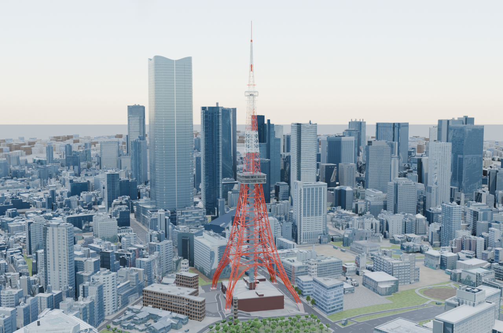](after-tower-context.png) |
| 敷地俯瞰 | [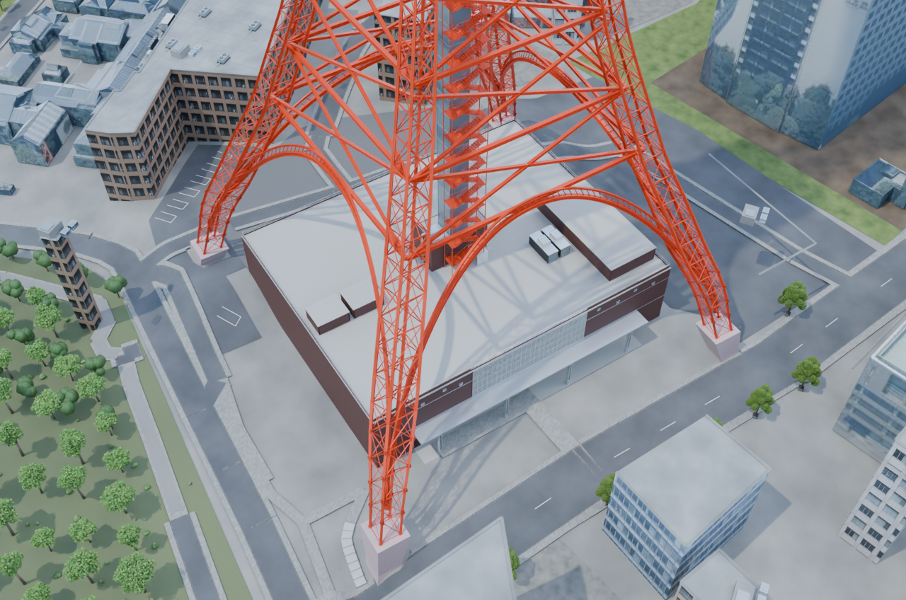](before-site-overhead.png) | [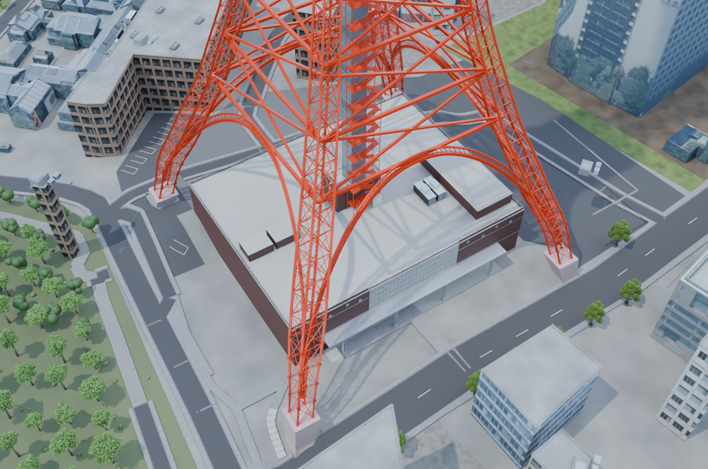](after-site-overhead.png) |
| 北側階段と歩道 | [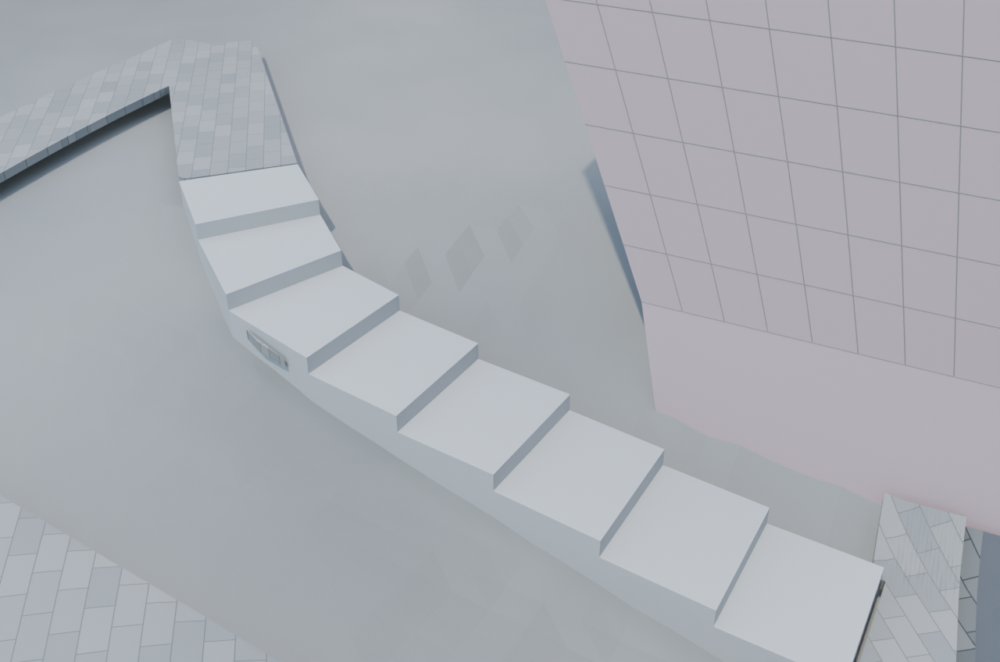](before-north-stairs.png) | [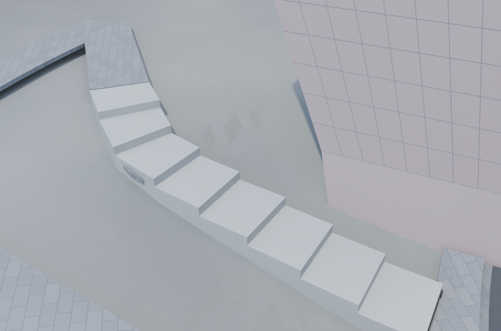](after-north-stairs.png) |
| 南側の道路・歩道 | [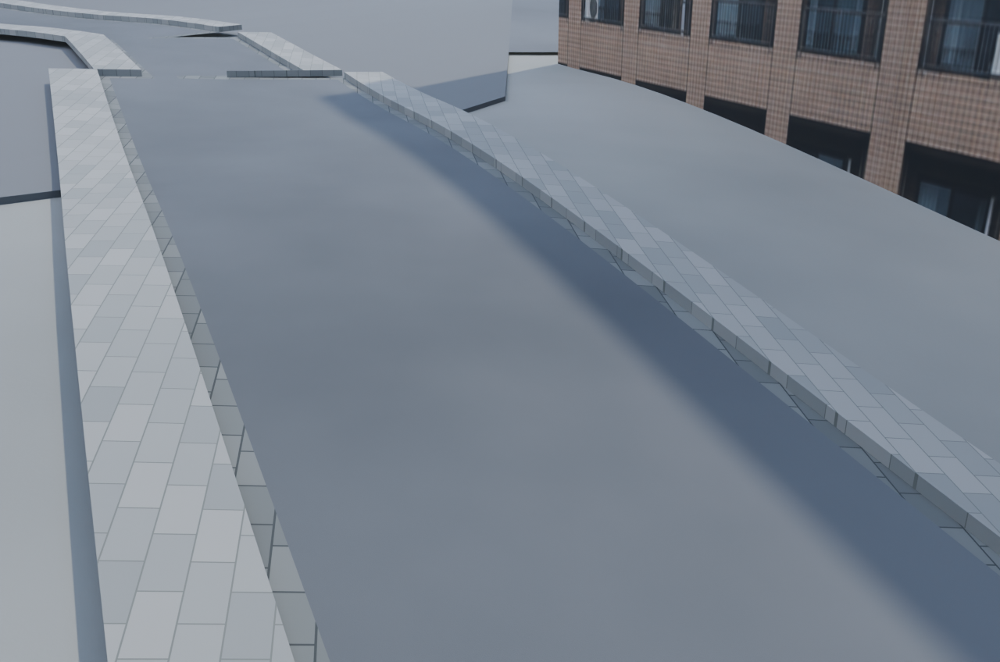](before-south-road-vehicle.png) | [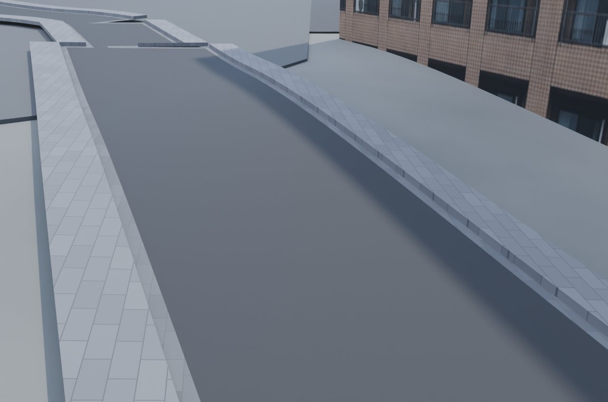](after-south-road-vehicle.png) |
| 西側の車道・側溝 | [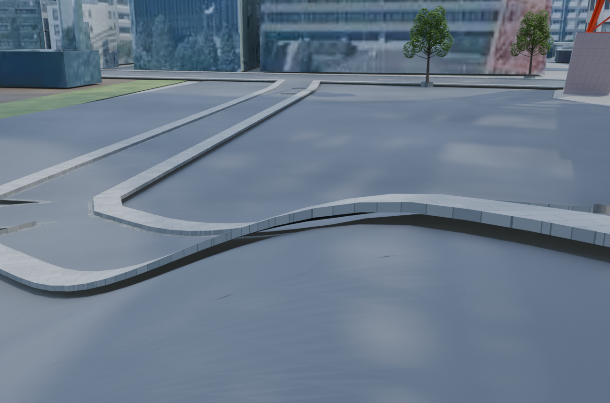](before-west-road-vehicle.png) | [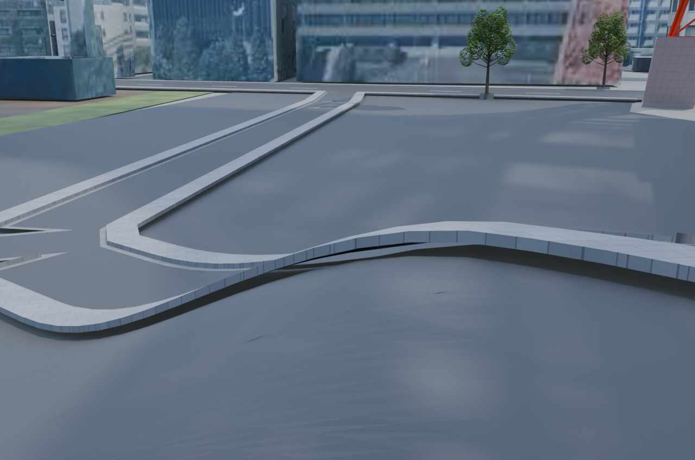](after-west-road-vehicle.png) |

Blender 4.5.1 LTS、Cycles/OptiX、1280×848、32 samples、seed 0。PNGのテキストmetadataのみ除去し、圧縮画像と復号画素を保持しています。

[変更内容・推定箇所](../../../docs/road-finish-v1.md) / [保存後検証](../../../docs/road-finish-v1-validation.json) / [画像・コードのhash](evidence.json)。人間による採用判断は未完了です。

## 出典・公開範囲

- 地図由来部分：© [OpenStreetMap contributors](https://www.openstreetmap.org/copyright)、[ODbL 1.0](https://opendatacommons.org/licenses/odbl/1-0/)。
- 前版の地盤には国土地理院の標高データの加工を含みます。
- 建物・画像には国土交通省 Project PLATEAU由来の加工データとark4ez / OurJapanの独自制作物を含みます。[NOTICE](../../../NOTICE.md)、[都市の出典表示案](../../../sources/city-distribution-NOTICE.draft.md)、[個別ライセンス](../../../LICENSE.md)を参照してください。

公開対象はPRレビュー用PNGと説明・検証metadataです。都市blend・素材原本の配布や、画像全体へのMIT／CC BY等の一括許諾を意味しません。第三者素材の条件と既存の確認中事項を保持します。
