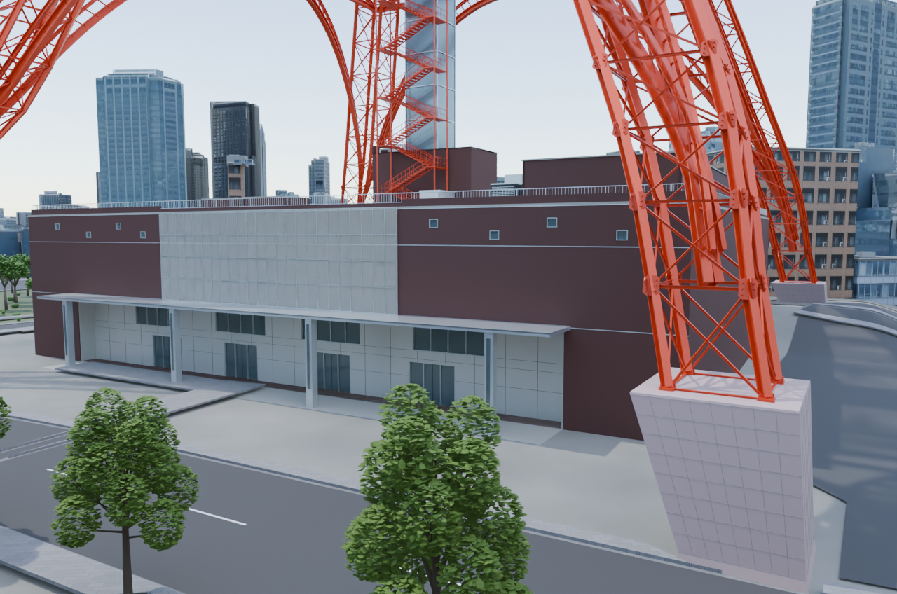
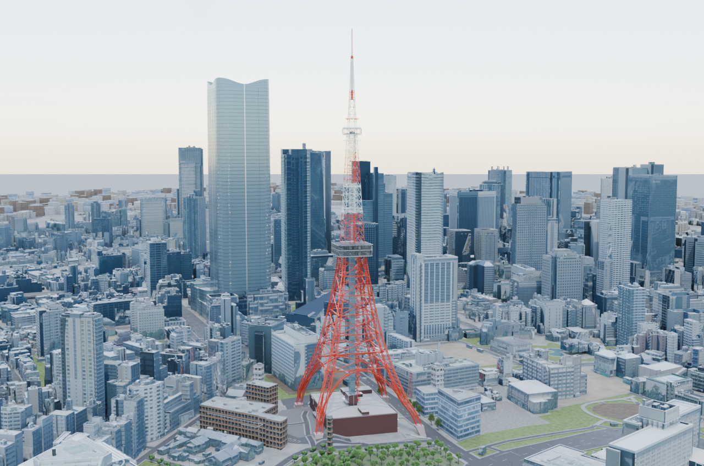
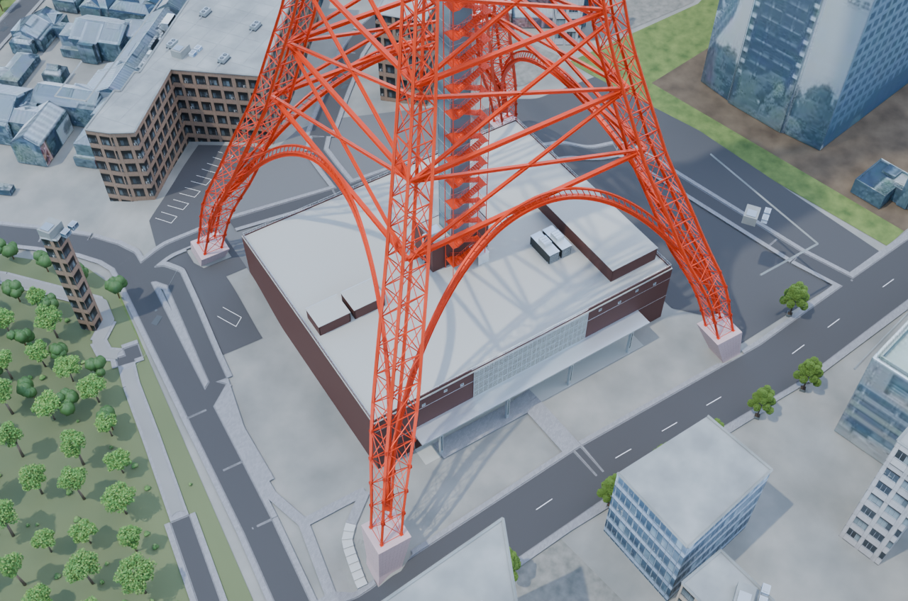
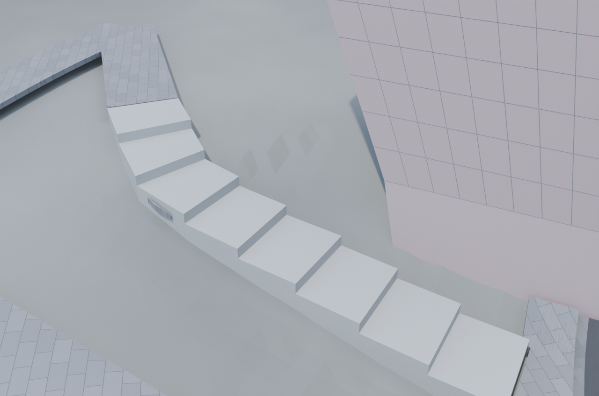
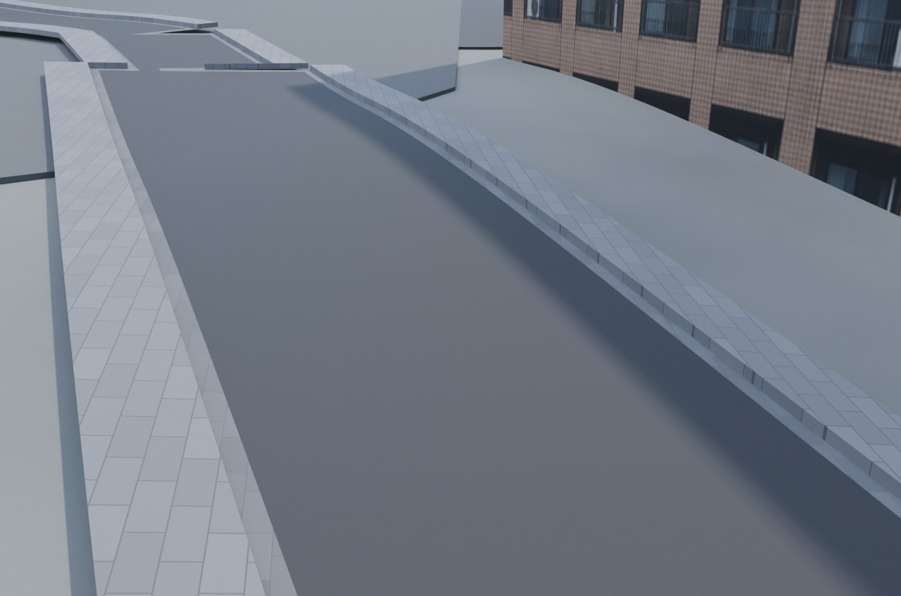
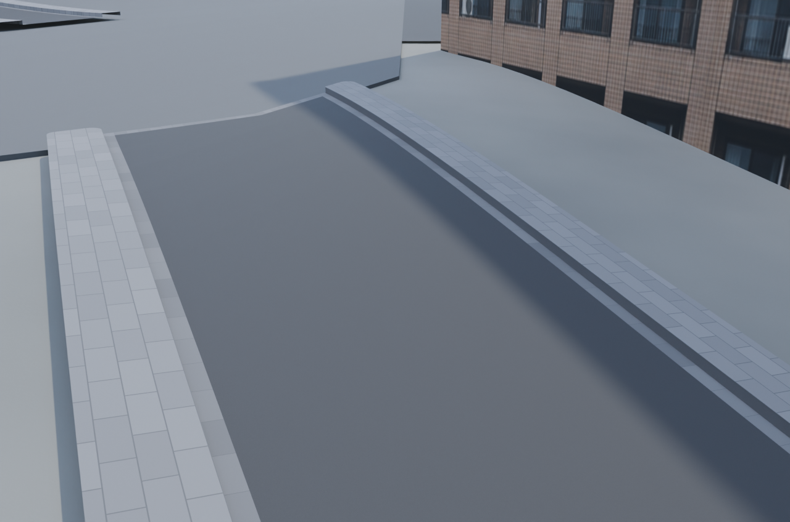
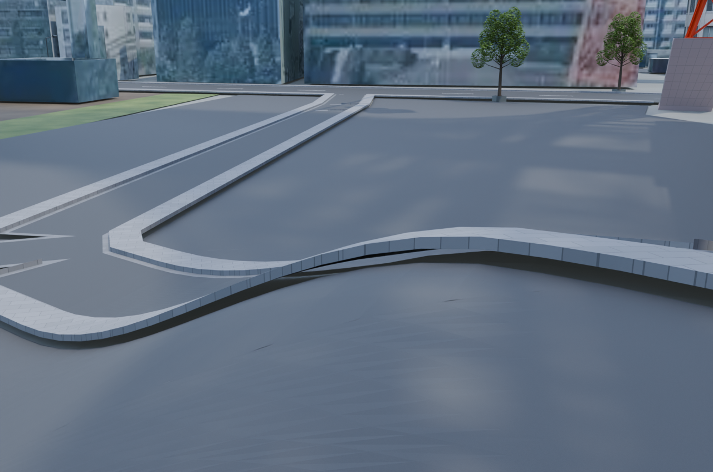
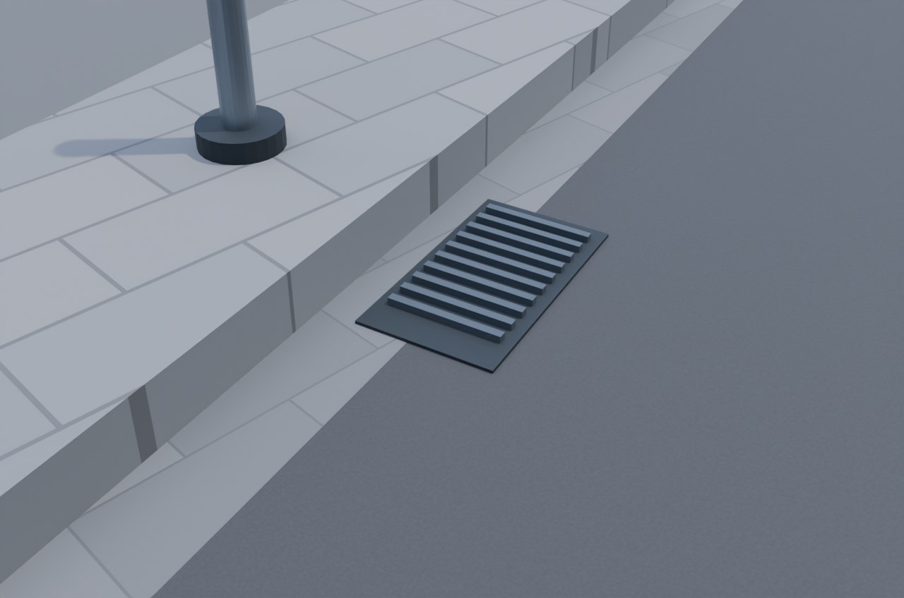
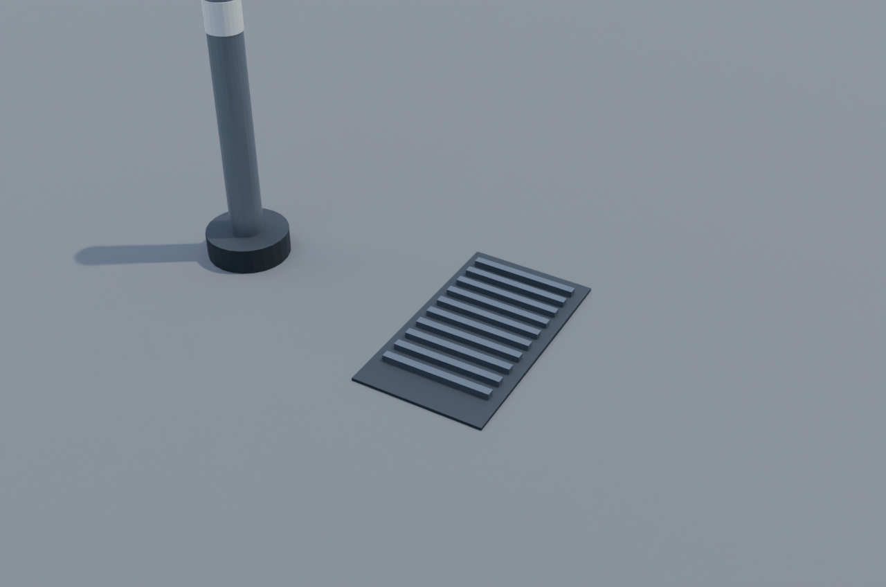

# 東京タワー周辺の道路・歩道の接続と細部

同じカメラ・照明・設定で描画した7視点・14枚です。西側と南側の車道・側溝・歩道・駐車場の接合部を整理し、目地を経路に沿わせています。元の相対地盤を引き継ぎ、歩道境界の高さを接続しました。既存の蓋・排水口と駐車区画の位置は保ち、接地を補正しています。寸法・割り付け・設備配置は推定を含みます。

蓋・排水口の近景だけは、元から描画非表示の設備を一時表示した診断画像です。Before/Afterに同じ表示を適用し、blendには保存していません。他の6視点は通常表示です。

| 視点 | 変更前 | 変更後 |
|---|---|---|
| 正面と歩道 |  |  |
| タワー全景 |  |  |
| 敷地俯瞰 |  |  |
| 北側階段と周辺保持 |  |  |
| 南側の道路・歩道 |  |  |
| 西側のカーブと舗装 |  |  |
| 蓋・排水口・車止めの接地（診断表示） |  |  |

Blender 4.5.1 LTS、Cycles/OptiX、1280×848、32 samples、seed 0。PNGのテキストmetadataのみ除去し、圧縮データと復号画素を保持しています。

[変更内容・推定箇所](../../../docs/road-geometry-v2.md) / [保存後検証](../../../docs/road-geometry-v2-validation.json) / [画像・コードのhash](evidence.json)。人間による採用判断は未完了です。

## 出典・公開範囲

- 地図由来部分：© [OpenStreetMap contributors](https://www.openstreetmap.org/copyright)、[ODbL 1.0](https://opendatacommons.org/licenses/odbl/1-0/)。
- 前版の地盤には国土地理院の標高データの加工を含みます。
- 建物・画像には国土交通省 Project PLATEAU由来の加工データとark4ez / OurJapanの独自制作物を含みます。[NOTICE](../../../NOTICE.md)、[都市の出典表示案](../../../sources/city-distribution-NOTICE.draft.md)、[個別ライセンス](../../../LICENSE.md)を参照してください。

公開対象はPRレビューPNGと説明・検証metadataです。都市blend・素材原本・音源・参照写真の配布や、画像全体へのMIT／CC BY等の一括許諾を意味しません。第三者素材の条件と既存の確認中事項を保持します。
