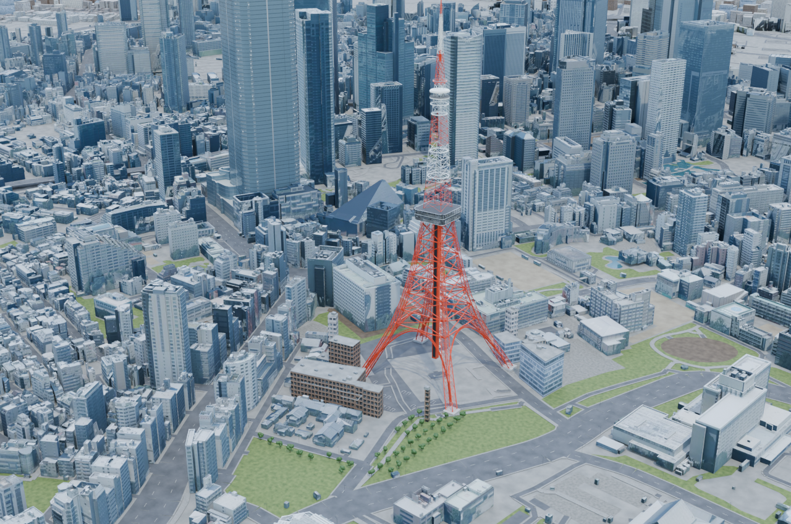
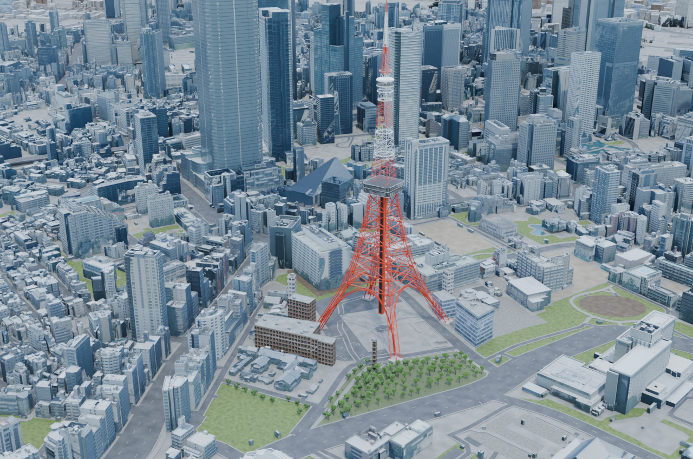
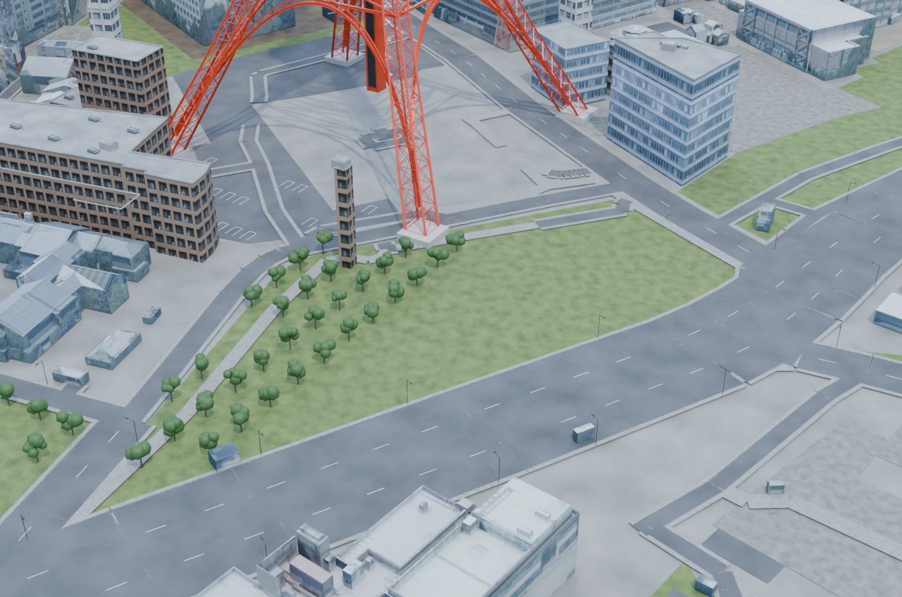
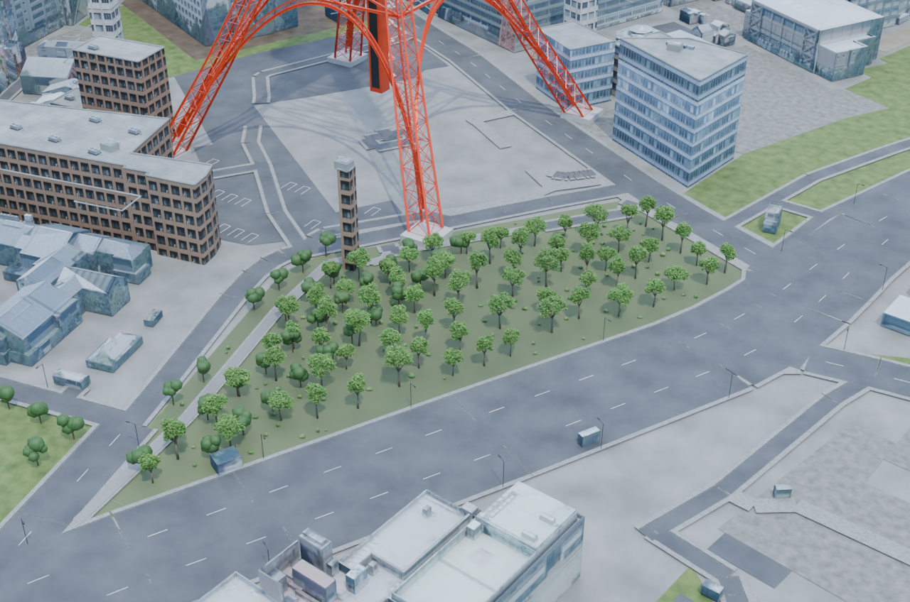
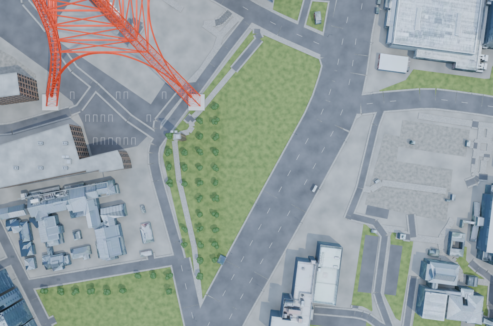
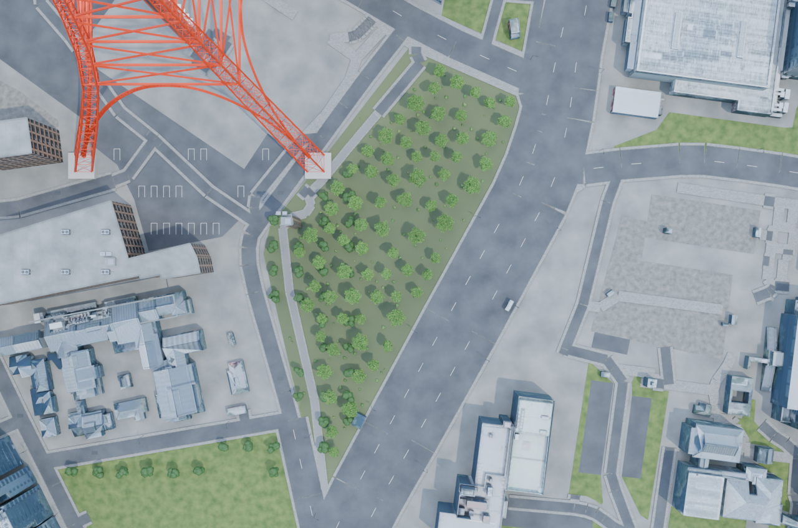
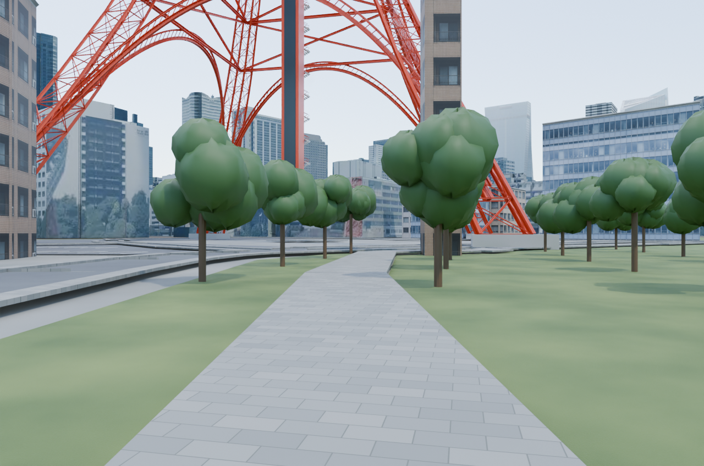
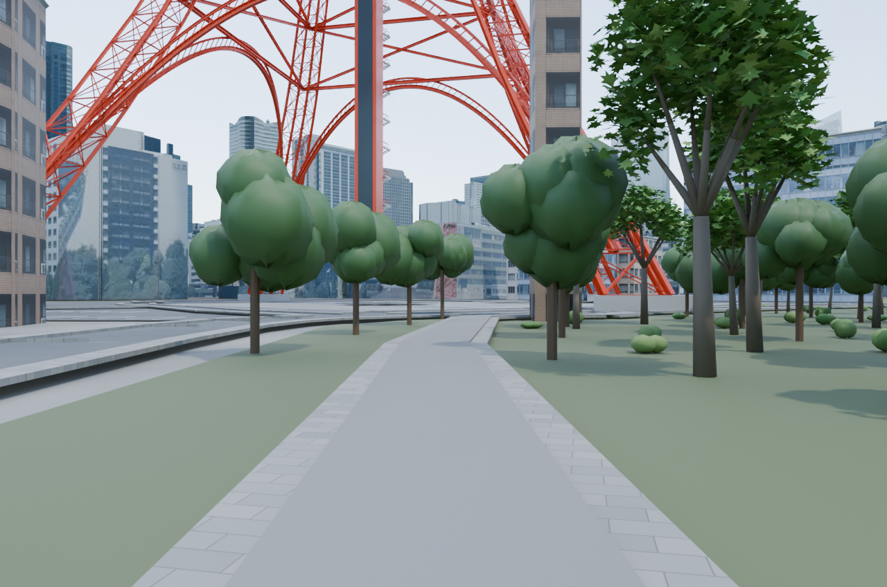
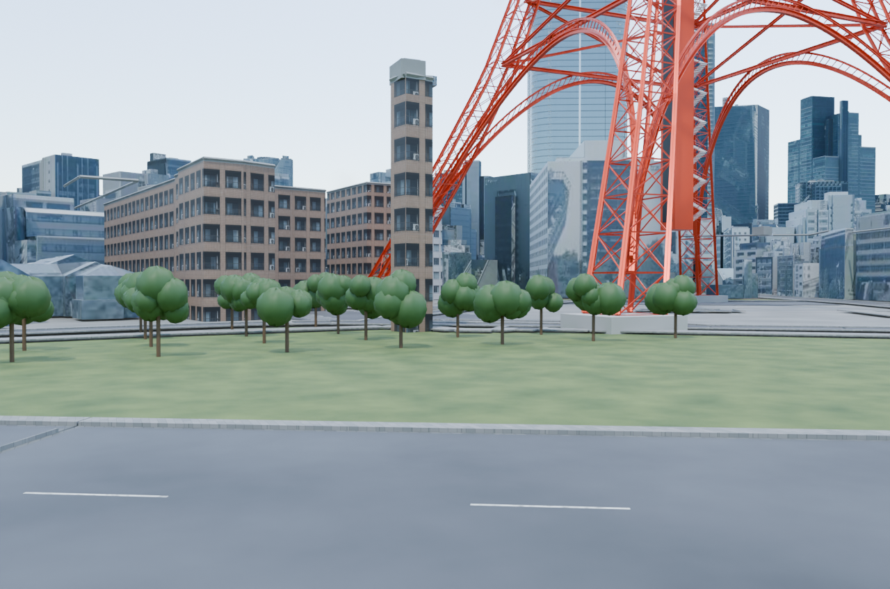
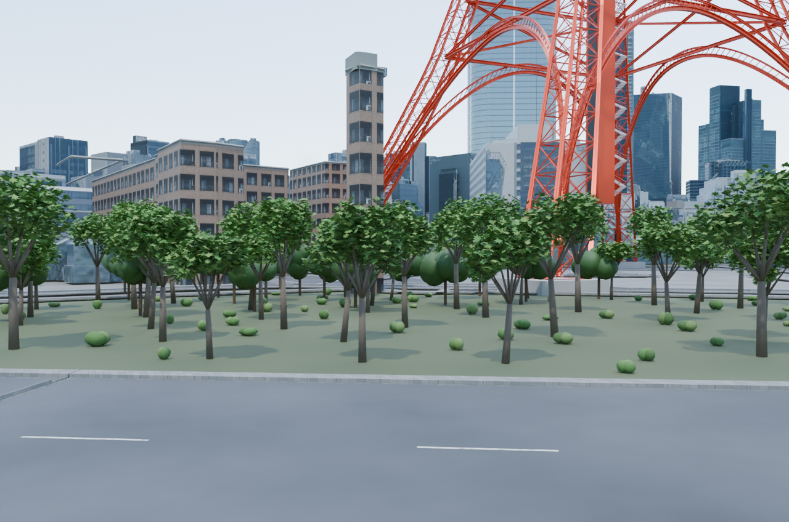

# 芝公園もみじ谷：5視点の比較画像

左が変更前、右が変更後です。画像をクリックすると元のPNGを開けます。樹木75本・低木120株・園路を追加した初版候補で、植栽配置・寸法・高さは推定です。滝・渓流・橋・実際の高低差は未実装です。

| 視点 | Before | After |
|---|---|---|
| 東京タワーとの位置関係 |  |  |
| 樹林の全景 |  |  |
| 真上からの配置 |  |  |
| 西側の園路 |  |  |
| 東側の道路境界 |  |  |

Blender 4.5.1 LTS、OptiX、1280×848、32 samples、seed 0で、各組のカメラ・照明・レンダー条件を揃えています。検証した実装はcommit `f986e04bfe78a49c4f88e2cbe6055e2f324f49ab`です。既存の最終PNGを変更せず掲載しました。[画像と入力・出力のhash](evidence.json) / [保存後の検証結果](../../../docs/shiba-momijidani-v1-validation.json) / [変更内容・推定・制約](../../../docs/shiba-momijidani-v1.md)。

2026-10-02のユーザーによる画像掲載依頼に基づくPRレビュー用の公開です。人間による画像の採用判断は未完了です。

## 出典・利用条件

- 林地・園路の平面配置と既存都市の地図由来部分：© [OpenStreetMap contributors](https://www.openstreetmap.org/copyright)、[ODbL 1.0](https://opendatacommons.org/licenses/odbl/1-0/)。対象の固定データと推定箇所は[もみじ谷の出典記録](../../../sources/shiba-momijidani-v1.json)に記載しています。
- 既存都市の建物・画像には国土交通省 Project PLATEAU由来の加工データ、独自部品にはark4ez / OurJapanの制作物を含みます。[出典・依存関係](../../../NOTICE.md)、[都市の出典表示案と未確認事項](../../../sources/city-distribution-NOTICE.draft.md)、[個別のライセンス適用範囲](../../../LICENSE.md)を参照してください。
- 東京都公園協会の園内図・写真は参考資料として参照したもので、この画像への貼り込みやテクスチャへの転用はありません。今回追加した葉にも外部画像を使用していません。

公開対象は比較PNG10枚と説明・検証metadataです。都市blend・素材原本・地図データの配布や、画像全体への新たなMIT／CC BY等の一括許諾を意味しません。第三者素材の条件と既存の確認中事項は保持します。
