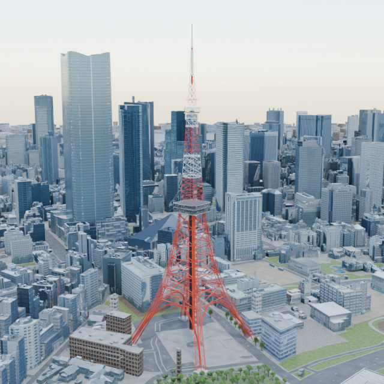
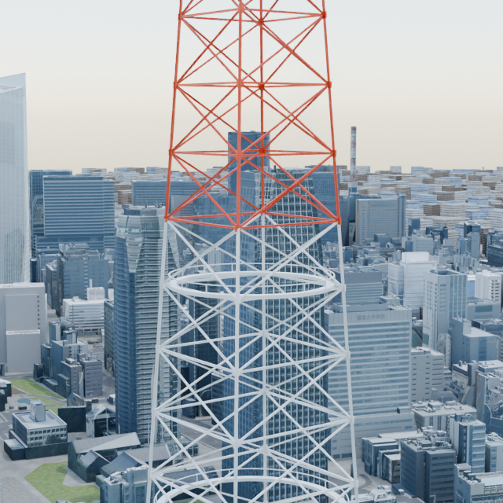
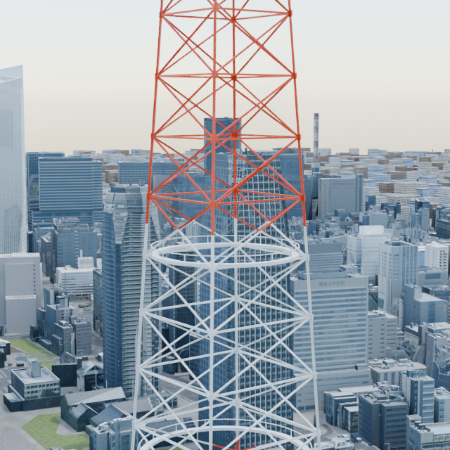
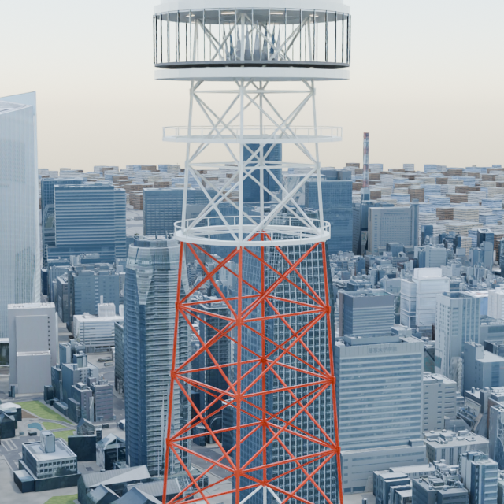
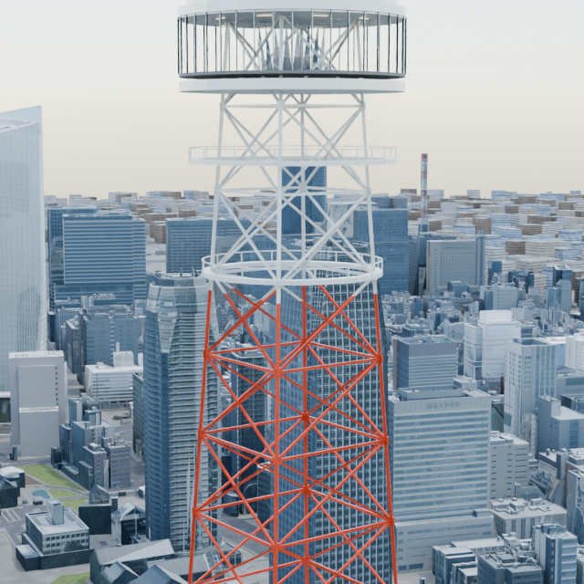
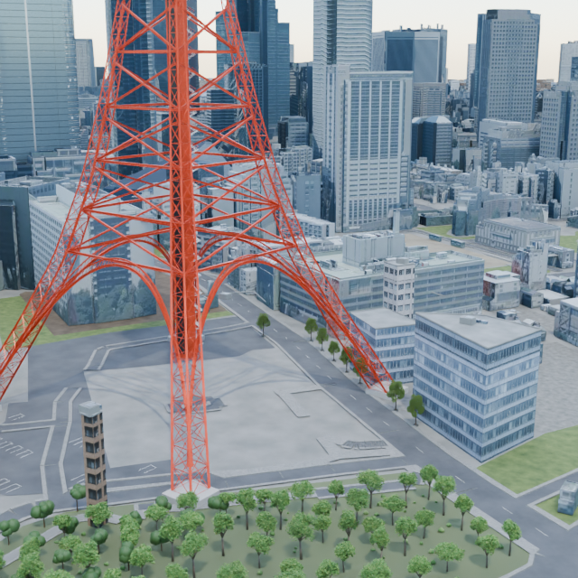
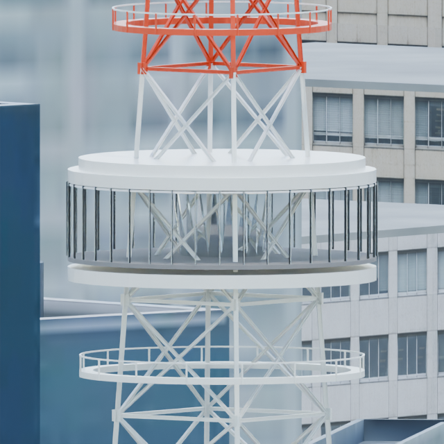
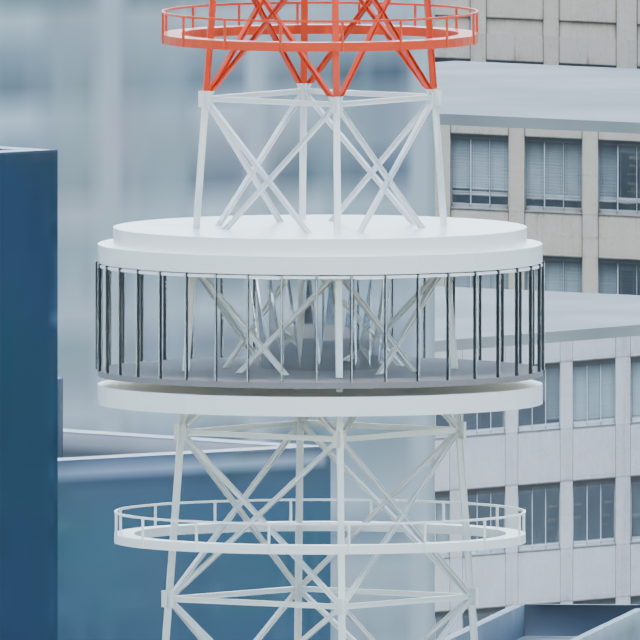
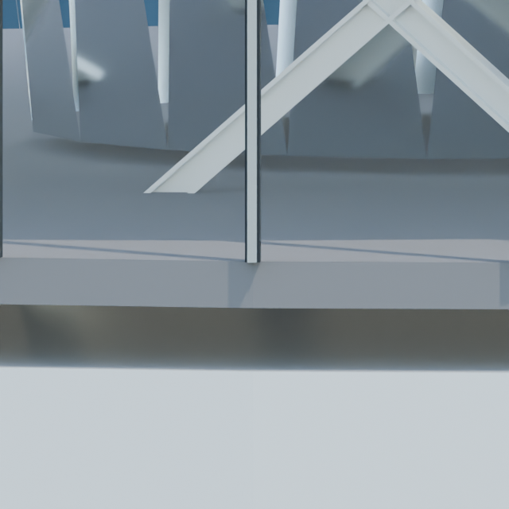

# 東京タワー都市統合：比較画像

同じPR47＋#49＋#51＋#52都市をBeforeにして、塗装とトップデッキ接合を反映したAfterを比較しています。Blender 4.5.1 / Cycles CPU / 640×640 / seed 0 / 2 threads。下端近景32 samples、他8 samples、denoising ON。各組のcamera・照明・World・色管理は一致。

| 視点 | Before | After |
|---|---|---|
| 全景 |  |  |
| 205 m帯 |  |  |
| 230 m帯 |  |  |
| 足元と樹木 |  |  |
| トップデッキ |  |  |
| 窓下端 |  |  |

寸法と境界はモデル上の推定値です。現地測量や全接合部の実物復元を示しません。PNGのtext／EXIF等だけを除去し、画素・色chunk／IDATは保持しています。

東京タワー対象モデル：ark4ez / OurJapan、CC BY 4.0。背景cityは従来のPLATEAU等の出典・利用条件を保持。OSM由来の説明用配置は © OpenStreetMap contributors、既存ODbL条件を保持。本画像公開はcityやtextureの再配布許諾を追加するものではありません。参考写真は配布しません。

[検証と再現](../../../docs/tokyo-tower-city-repairs-v1.md) / [出典](../../../NOTICE.md)
