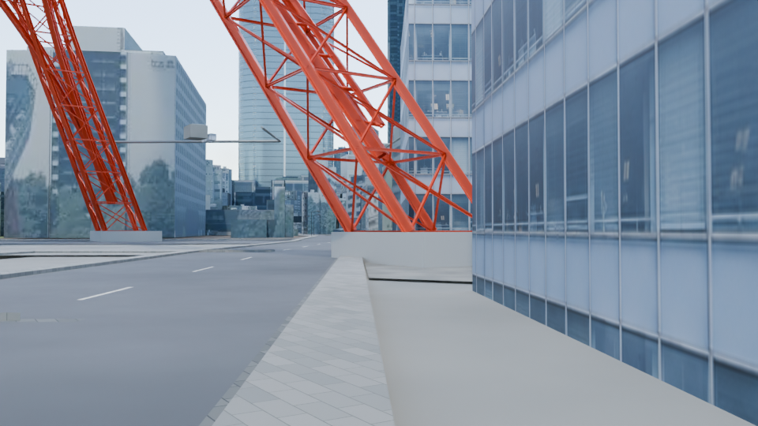
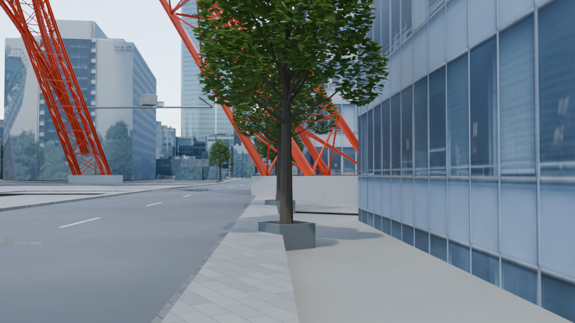
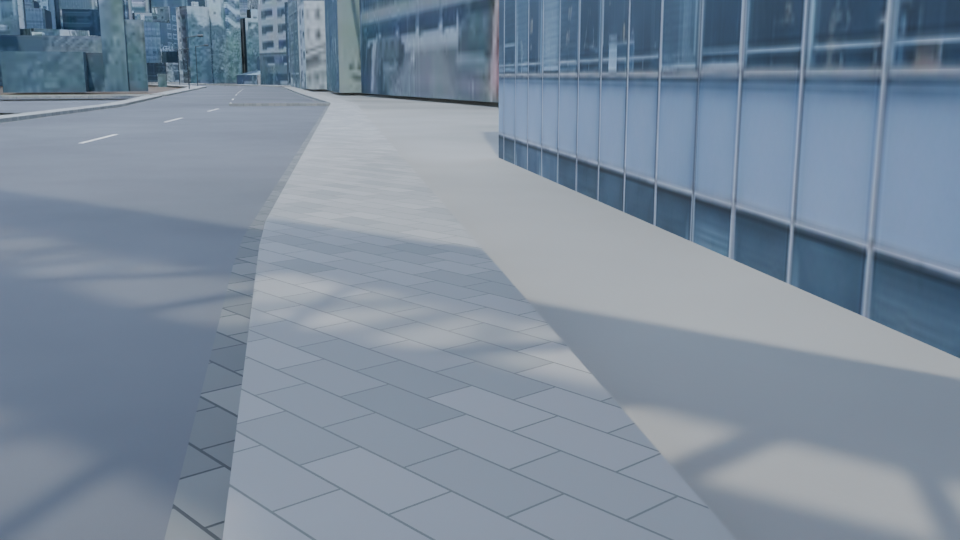
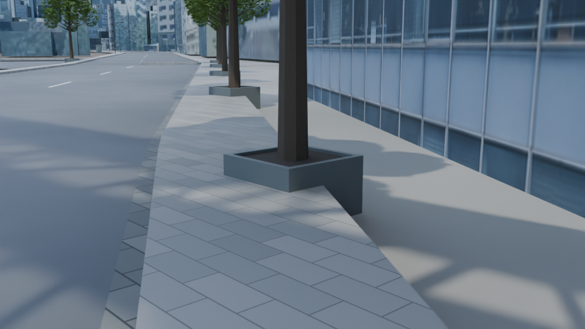
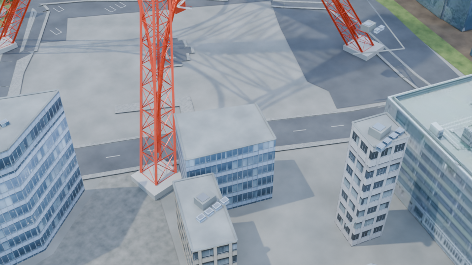
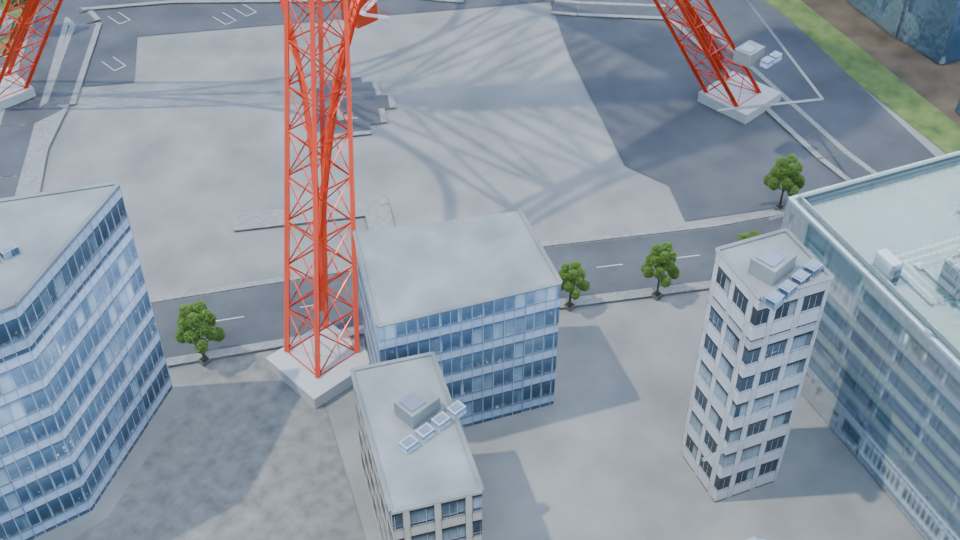

# 東京タワー北東側の並木・植樹枡：同条件比較

PR #47の園路候補をBeforeに固定し、イチョウ8本と箱形植樹枡を加えた制作候補です。Blender 4.5.1 LTS、Cycles OptiX、960×540、16 samples、seed 0、frame 1。各組のカメラ・照明・色管理は同じです。

## 道路沿いの近景

| Before | After |
|---|---|
|  |  |

## 根元と植樹枡

| Before | After |
|---|---|
|  |  |

## 中景と周辺の街

| Before | After |
|---|---|
|  |  |

元のモデルXYを保持した説明用配置です。樹種・本数・実在位置と現地高度は未確認です。植樹枡は独自の提案で、土面Z=0.68m・縁Z=0.72mを既存舗装Z=0.46mより高くしています。配置166だけ表示幅を95%へ調整しました。植樹枡下部は地盤まで伸ばす挿入表現で、既存舗装と重なる部分を含みます。歩道の掘削・交通用衝突形状は未制作です。

[範囲・根拠・再現手順](../../../docs/tower-approach-trees-v1.md) / [入力・画像hashと保存後検査](../../../docs/tower-approach-trees-v1-validation.json)。4つの植栽視点と2つの園路視点、全12枚はローカルで検査しています。人間の採用判断は保留です。

## 公開承認とクレジット

2026-10-02、アカウント保有者がこの制作の比較画像を添えたDraft PR公開を許可しました。この6枚はレビュー用証拠として公開します。都市blend・packed texture・固定入力・私的ログは含みません。PNGのtext／EXIF metadataを除去し、画像・色のchunkとIDATを維持したことを検証JSONへ記録します。

イチョウprototype・指定材質：ark4ez / OurJapan、[既存CC BY 4.0許諾範囲](../../../assets/procedural-components/ASSET-LICENSE.md)、[prototype NOTICE](../../../assets/procedural-components/NOTICE.md)。既存の説明用街路配置の入力：© [OpenStreetMap contributors](https://www.openstreetmap.org/copyright)、既存ODbL条件。PLATEAUを含む背景都市・第三者素材は[NOTICE](../../../NOTICE.md)、[PLATEAU NOTICE](../../../starter/plateau/NOTICE.md)、[LICENSE](../../../LICENSE.md)の出典・権利範囲を保持します。この公開で元cityや第三者素材に新しいライセンスを付与していません。
