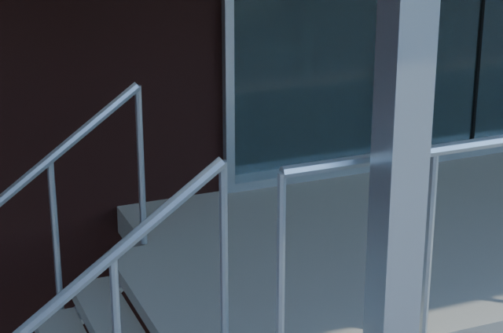
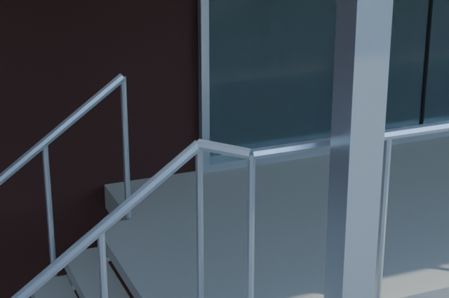
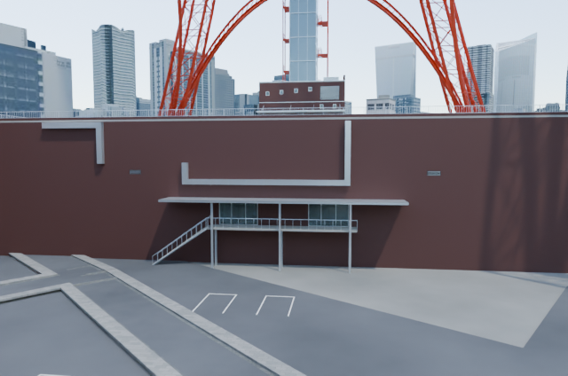

# South stair handrail: matched comparison

Cycles/OptiX, 640 x 424, 16 samples, seed 0. Left: pinned PR60 model. Right: reopened saved candidate.

| View | Before | After |
|---|---|---|
| south-handrail-detail |  |  |
| foottown-south |  |  |

Only PNG text metadata was removed; all retained chunks (including IDAT pixel data) are byte-identical to the new renders. All eight inherited acceptance views and the local detail were rendered and inspected; the remaining views stay in ignored local output.

Inferred model coordinates, not a real-world survey. See [scope and reproduction](../../../docs/tower-south-handrail.md), [verification](../../../docs/tower-south-handrail-validation.json) and [asset notices](../../../NOTICE.md). City scene, original textures and reference photographs are not included.
