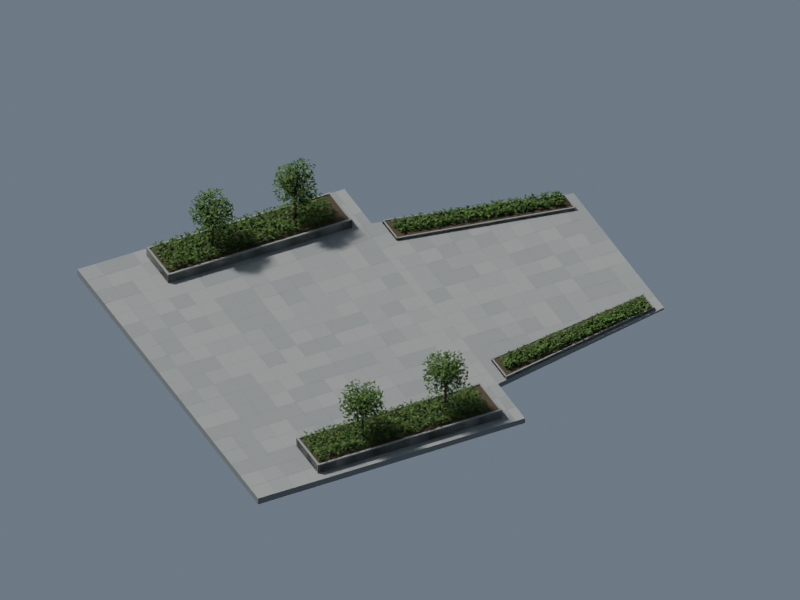
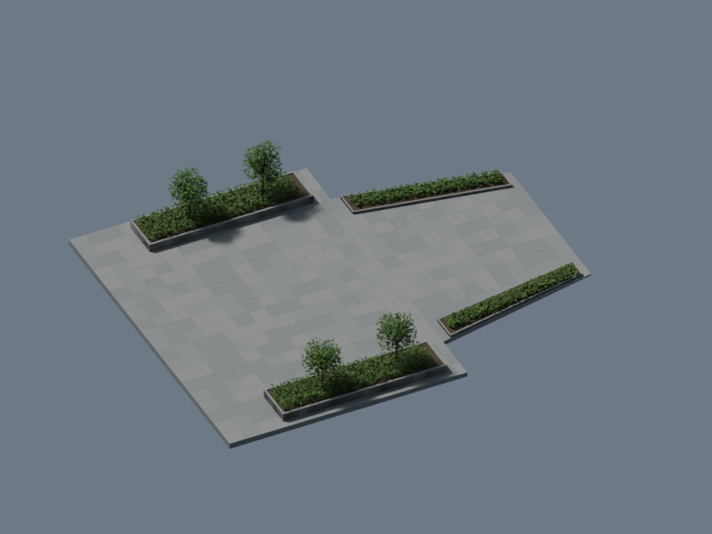

# 6部品から始める OurJapan

巨大な都市ファイルなしで、舗装・植栽桝・植栽の6部品を生成し、変更前後を比較する参加用サンプルです。東京全体や森JPタワー本体は含みません。PythonとBlenderを実行できるPCが必要です。GitHubを使わず画像を見て報告する参加方法とは別の、実装者・AI向けの入口です。

## 実行する

初めての方は[取得・Pythonの確認・実行・投稿準備を順に進めるガイド](first-contribution.md)を参照してください。画像を見て報告するだけの参加方法も選べます。

このリポジトリをclone、またはGitHubの「Code → Download ZIP」で取得・展開してください。`starter/plaza`だけを取り出すと依存コードが不足します。参照環境はPython 3.12、Blender 4.5.1 LTS。追加のpipパッケージ・都市データ・外部Textureは不要です。

リポジトリのルートから、Blenderの場所を自分のPCに合わせて実行します。

```powershell
python starter/plaza/run.py --blender "C:/Program Files/Blender Foundation/Blender 4.5/blender.exe" --output build/plaza-first --paving-brightness 0.85
```

macOS・Linuxも同じPython CLIを使用し、`--blender`にその環境の実行ファイルのパスを指定します。初回検証はWindowsで実施。他OSでの実機確認は未実施です。CPUレンダリングを使い、専用GPUを必須にしません。出力先は毎回新しい名前を指定してください。

完了したら出力先の`review.html`をブラウザで開きます。`before/scene.blend`と`after/scene.blend`はBlenderで編集できます。これは舗装の明るさだけを変える操作例であり、現実との差分を直したという主張ではありません。Beforeも、このサンプル用に照明と材質の粗さを設定し直した表示です。

## 共有用ZIPを作る

現在のrun.pyで生成に成功した出力に対して、リポジトリのルートで実行します。

```powershell
python starter/plaza/package.py --run build/plaza-first --output build/plaza-share
```

`plaza-share/review-package.zip`と内容一覧`inventory.json`、ZIP自体のhashを持つ`package-result.json`ができます。出力先は新しいフォルダを指定します。ZIP全体を展開し`review.html`を開いて内容を確認した後、必要に応じて自分で共有します。自動アップロードは行いません。

対象はBefore/After画像、選別した検証JSON、出典・ライセンス、明るさの変更説明、実行時と一致した6コードと再現コマンドです。生成コードも入るため、追加したコードや素材の公開条件は本人が確認してください。`.blend`・ログ・元HTML・未知のJSON項目は含めません。自動で利用許諾を判定する機能ではありません。

画像・検証・出典のhashが実行記録と一致しなければ停止し、コードが実行後に変更されていても停止します。記録にoutput_sha256がない以前の結果は、現在のrun.pyで新しい出力先へ再生成してください。コードの版は同梱ソースとそのSHA-256で特定します。

梱包はBlenderを再実行せず、レンダリング時の検証記録を確認します。PNGは記録hashとヘッダー・寸法の確認であり、再デコード検査ではありません。記録と画像が同時に改ざんされた場合を証明する署名ではありません。各入力ファイルは4MB以下に限定しています。

## AIに頼む例

> starter/plaza/README.mdと適用ライセンスを読んでください。新しい出力先で舗装の明るさを0.9にして比較を生成し、run.jsonと両方のvalidation.jsonを確認してください。形状は変えず、結果の画像を見せてください。現実の改善として提案する場合は別途根拠と推定箇所を記録してください。

次に形状を変更する場合は生成コードを編集し、変更前のコード・出力も保存して比較してください。現在のCLIは**材質パラメータの比較専用**です。任意の形状変更や手作業で保存したblendを比較する一般的なパッチ機能ではありません。

## 検査と記録

- Before／Afterをそれぞれ別プロセスで生成し、保存後にさらに別プロセスで開いて検査・描画します。
- 6メッシュの指紋、有限座標、ゼロ面積三角形、材質、外部画像等の不在、カメラ種別、PNGを検査します。前後の形状が一致することも検査します。
- `run.json`にソースSHA-256、Blender版、処理時間、結果を記録。失敗時は終了コードが非ゼロとなり、ログと`ok: false`を残します。
- 実物との一致、全ての法線・重なり、測量精度、メモリ上限は保証しません。GitHub CIでBlenderを実行する仕組みではなく、ローカル実行です。

PRには変更コード、パラメータ、許諾済み比較画像と検証結果を添付します。`.blend`や巨大なログをそのままGitに追加しません。人間がレビューし、採否を決めます。[参加ルール](../../CONTRIBUTING.md)を参照してください。

## 利用条件と根拠

対象の独自コードはファイルを限定したMIT、6部品・このサンプルの文書・プレビューはCC BY 4.0です。[コードの適用範囲](../../LICENSE.md)、[モデルの利用条件と表示例](ASSET-LICENSE.md)、[出典・推定箇所](provenance.json)を確認してください。

公開する基本単位は、小さい生成コードと出典です。生成されたblend・画像は各自のPCで作成できます。元の都市データを再配布可能にしたり、全都市を再構築可能にしたりする変更ではありません。

## 検証済みの表示例

| 基準表示 | 舗装の明るさ0.85 |
|---|---|
|  |  |

Blender 4.5.1 LTS・CPUで計11.0秒（手元の1回の測定）。1シーン約3.05 MB。35件の既存テストと、保存後にメッシュを移動すると失敗する検査を確認しました。[実行記録](verification.json)。表示例もCC BY 4.0です。
