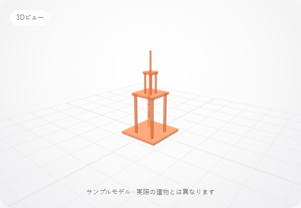

# 静止した3Dビューの必要時描画

2026-10-02、main `805310ef7a6aad5a13104334e798fb83b35f1711` を基準に検証した。静止している3Dビューでも、`frame()` が次の `requestAnimationFrame` を無条件に要求し、毎回同じシーンを描画していた。ブラウザのリフレッシュ周期で不要なWebGL描画と診断情報更新が続いていた。

`src/render-loop.js` で表示変更を1フレームへまとめる。モデル読込、濃さ、サイズ、視点変更、ページ復帰、WebGL復旧で描画を要求し、静止したら次のフレームを予約しない。カメラ使用中は従来どおり描画を続ける。OrbitControlsは標準のchange判定を超える小さな減衰も続け、1フレームのカメラ移動が `1e-7` 表示単位以下になったら休止する。これにより、減衰を途中で止めた場合の微小な画角差を抑える。モデル、材質、照明、アンチエイリアス、解像度は変更していない。

## 計測

Windowsの専用headless Edge 154.0.4258.48、Node 24.19.0、Playwright 1.62.1を使用した。同じ960×900 viewport、device scale factor 1で、読込後の静止状態を約2.5秒ずつ3回記録した。各計測の生データは [before/report.json](evidence/idle-rendering-20261002/before/report.json) と [after/report.json](evidence/idle-rendering-20261002/after/report.json) にある。

| 1回の計測の中央値 | Before | After |
| --- | ---: | ---: |
| シーン描画回数 | 361 | 0 |
| WebGL draw call | 4,693 | 0 |
| ページのTaskDuration差分 | 151.047 ms | 0.555 ms |
| ページのScriptDuration差分 | 62.841 ms | 0 ms |

WebGLのclearを描画回数として数え、drawElements/drawArraysをdraw callとして数えた。CPU欄はCDP `Performance.getMetrics` の差分で、当該ページの処理時間である。端末全体の使用率やバッテリー改善率ではない。実際の計測時間はBefore 2,504.3〜2,516.0ms、After 2,503.8〜2,512.9msだった。

カメラ使用中はBefore 139描画/1,012.4ms、After 143描画/1,014.2msを記録した。回転の減衰中も描画を続け、操作終了、カメラ終了、復帰後の静止状態では描画が止まった。読み込み速度・市街地全体のFPS改善は計測していない。

## 表示品質

既存の公開fixtureを実際にGLTFLoaderで読み込み、WebGL表示した。3,036 bytes、144 triangles、SHA-256 `0bd314b3dc7e691f843293c490f4e27c6be3bc61bba28aad31dd12ed776d5f08` は保持されている。共通cityのBlenderモデルを変更・公開したものではない。

同じ条件でcanvas領域を撮影し、デコードしたRGBA値を全画素比較した。

| ビュー | 比較画素数 | 異なる画素数 | 最大8-bit channel差 |
| --- | ---: | ---: | ---: |
| 初期 | 246,148 | 0 | 0 |
| 不透明 | 246,148 | 0 | 0 |
| モバイル幅 | 145,348 | 0 | 0 |
| 回転の減衰終了後 | 246,148 | 3 | 2 |
| 視点リセット後 | 246,148 | 85 | 1 |

回転・リセット後には小さな数値差が残るため、全ビューが完全一致したとは報告しない。回転後の平均絶対channel差は0.00000914、リセット後は0.00014016だった。初期、モバイル、不透明の3ビューは全画素一致した。ブラウザ検証は異なる画素が0.1%未満、channel差が2以下であることを要求する。




## 検証と再実行

- `pnpm test`: 33件成功。予約の集約、休止、再開、描画中の再予約、カメラ/減衰継続を含む。
- `pnpm build`: 成功。21 modules、8-file offline shell。JS bundleは660,557→661,246 bytes。軽微な増加であり、転送量削減とは報告しない。
- `BROWSER_CHANNEL=msedge TEST_URL=<専用preview URL> node tests/render-browser.cjs`: 成功。濃さ・resize・OrbitControls・視点リセット・カメラ開始/終了・visibility・pagehide/pageshow・WebGL context loss/restoreを確認。
- 既存 `tests/field-browser.cjs`: 成功。連続撮影、同意境界、自動送信、reload後の同一retry、認証情報非永続化、オフライン撮影/catalogue、ZIP、ストレージ障害回復を確認。APIはローカルで応答を差し替え、実送信していない。
- `python -m unittest discover -s tests`: 224件、218成功・6skip。任意のShapelyがない1件、任意のOpenCVがない5件。viewer外の依存は追加していない。
- `git diff --check`: 成功。公開データ、adapter、モデル用patch、rootの検査・生成コードは変更していない。

ブラウザテストは既存のPlaywright依存を利用し、ブラウザが導入済みならダウンロード不要。`BROWSER_CHANNEL` を省略するとPlaywrightのChromiumを使う。`PERF_OUTPUT` は記録先を指定する。比較する場合は同じマシン・同じブラウザで基準commitのbuildも専用URLから配信する。

```sh
# Baseline: 基準commitから作ったbuildを専用URLで配信
EXPECT_IDLE=0 TEST_URL=<baseline URL> PERF_OUTPUT=<before output> node tests/render-browser.cjs

# Candidate: 改善後build。自分で採取したbaseline reportを指定
TEST_URL=<candidate URL> PERF_OUTPUT=<after output> BASELINE_REPORT=<before output>/report.json node tests/render-browser.cjs
```

PowerShellでは各値を `$env:TEST_URL='...'` の形式で設定する。テストは専用headlessインスタンスを起動し、既存ブラウザの画面を切り替えない。単体のcandidate検証では `BASELINE_REPORT` は不要。

[provenance.json](evidence/idle-rendering-20261002/provenance.json) に基準commit、検証したsource blob、build/fixture hash、検証範囲を記録した。全ログとビルドは作業worktreeのignored `data/local/viewer-performance/` にある。

今回はdesktop Chromiumとfake cameraによる検証まで。iPhone Safari、実カメラ、電池・発熱、共通cityの表示は未検証。次の確認はiPhone Safariで回転、濃さ、camera終了/再開、background復帰を試すこと。push/PRは親の統合確認後に行う。
