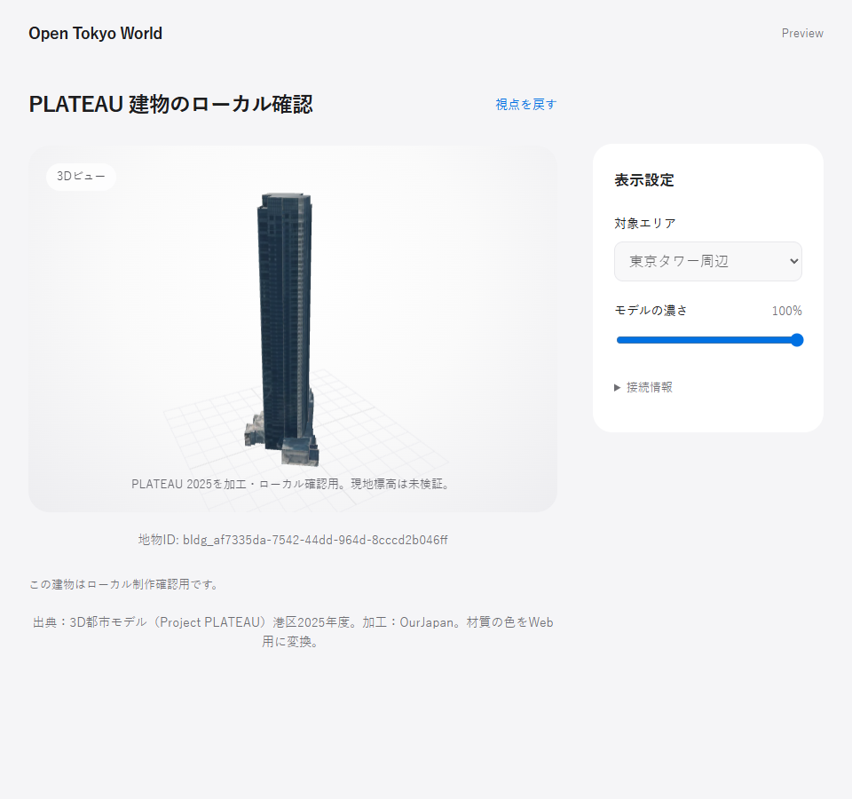
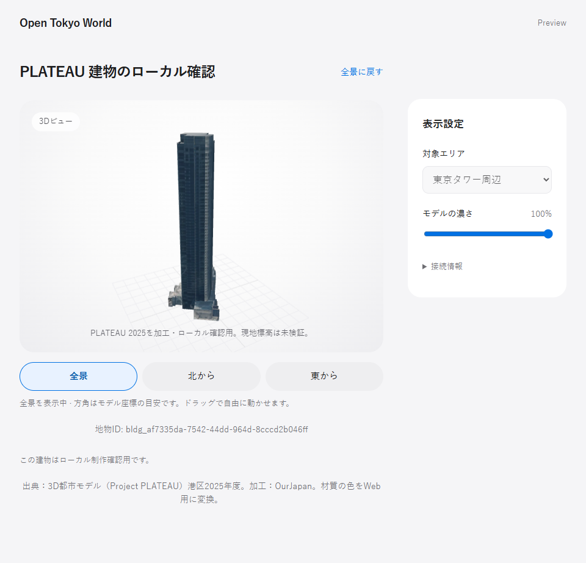
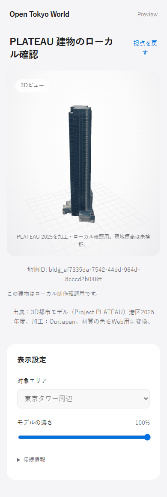
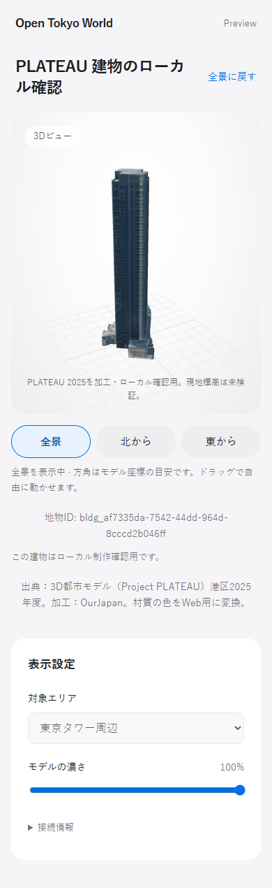
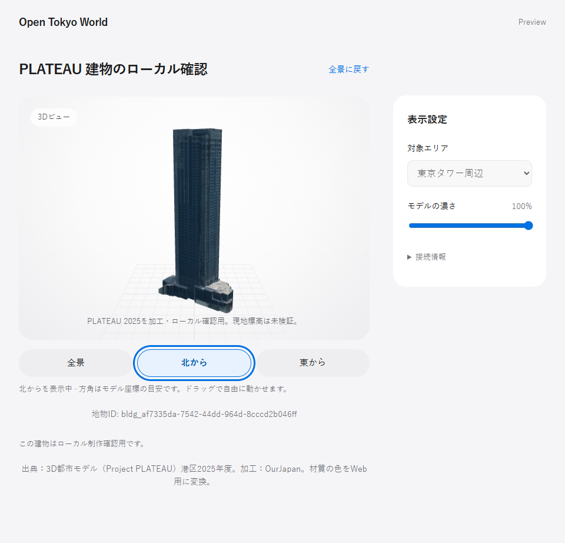
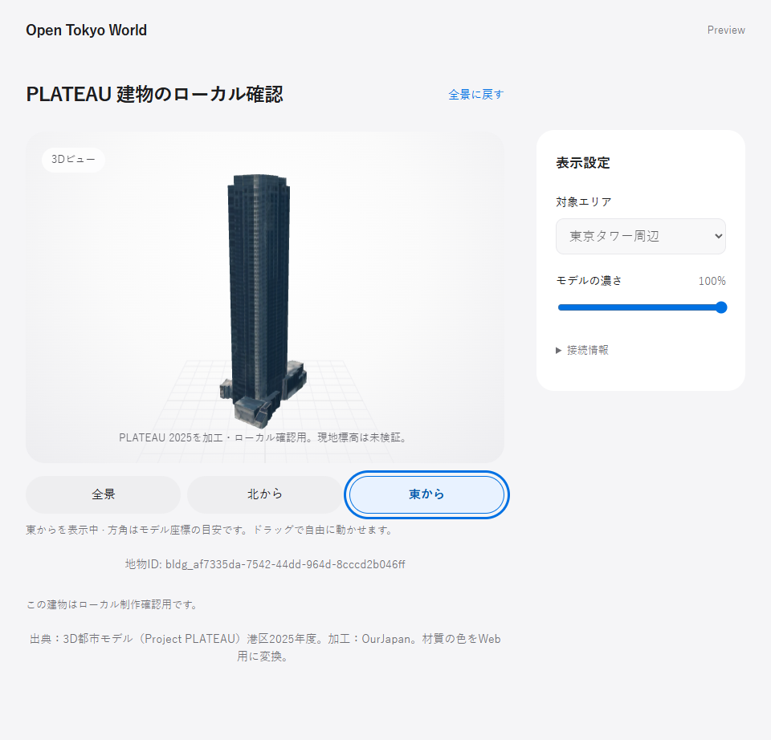

# ローカル建物表示・視点プリセットの統合検証

main `3b1eb5f6c10ca9c0ebb072348faea4981985439e` にローカル建物表示と全景・北・東の視点を統合しました。PR #50 は `29157af` でマージ済みのため、その idle 描画変更は main 経由で継承しています。

検証コードは `52175b1891c1cd1b5af94d87fffc307c7d36163c`。以降のコミットは本検証資料と比較画像の追加です。対象ソースの SHA-256 は [result.json](result.json) に記録しています。[HTML 比較ページ](review.html) は同じフォルダーの PNG と一緒にローカルで開けます。GitHub 上では本ページの画像から確認できます。

## 比較条件

Before は最新 main にローカル表示と異常系修正を適用した `d9da129855c876cade749daccbbd0d435611f82d`、After はその上に視点プリセットを追加した検証コードです。main 自体にはローカル建物表示がないため、この比較はプリセット追加前後を示します。別に main と After の通常モデル描画も比較しました。

同一 GLB、Headless Edge 154.0.4258.48、device scale factor 1、初期全景、濃さ100%。viewport は desktop 960×900、mobile 390×900。画像はページ全体のため高さは内容に応じて異なります。画像の切り貼りやモデル編集はありません。

| Before: 視点切替なし | After: 全景・北・東 |
|---|---|
|  |  |
|  |  |

| 北から（Enter） | 東から（Space） |
|---|---|
|  |  |

[mobile 東視点](after-east-mobile.png)、[Before 全景 canvas](before-overview-canvas.png)、[After 全景 canvas](after-overview-canvas.png)、[main 通常モデル canvas](main-fixture-canvas.png)、[After 通常モデル canvas](after-fixture-canvas.png) も保存しています。全景の前後と通常モデルの main/After はそれぞれ PNG がバイト一致しました。

## 検証結果

- Portable: 277件、270成功・7 skip・失敗0。skip は任意の Shapely 2件と画像推定依存5件。
- Viewer unit: 49件、46成功・3 skip・失敗0。通常symlink作成の Windows EPERM による skip。junction、data/local anchor、異常URLの400応答と後続正常応答は成功。
- Vite production build、offline shell、Python compileall、公開fixtureの再生成後差分なし。
- 実モデルbrowser: 9項目成功。全3視点で960×900／390×900／900×390／320×740の全体フィットと方向保持、Tab／Enter／Space、操作中resize、パン後の姿勢保持、慣性解除、読み込み失敗、カメラ起動なし、静止時idleを確認。手動resizeの最大変化は約1.73e-7。
- 既存field browser: 連続撮影、同意、mock送信、同一payload再試行、オフライン、ZIP、保存失敗回復が成功。描画遷移23項目も成功。外部APIへ送信せず、実カメラ・位置情報は使用していません。
- Productionはローカル表示を拒否し、privateモデルへのfetchなし。distのGLBは既存の独自fixture 1個のみ。
- Blender 4.5.1で対象blendから別ディレクトリへ再exportし、別processでGLBを再import。466三角形、2材質、最大座標誤差0m、既存atlas pixel差0、GLBとmanifestのSHA-256は引継ぎ版と一致。元blend・保持GLB・manifestも前後hash一致。

**Safari実機・実機タッチ・スクリーンリーダーは未検証です。** 北・東は既存モデル座標の目安で、測量済み方位・現地標高は未検証。1024pxのprocedural色bakeは近似です。

## 再現

[起動とbrowser比較手順](../../../../docs/local-building-view-presets.md) を参照してください。`node tests/local-views-browser.cjs` はローカル入力を別途必要とし、出力先を `LOCAL_VIEWS_OUTPUT` で指定できます。Beforeには上記コミットの別checkoutを使い、After側のbrowserスクリプトをコピーして `LOCAL_VIEWS_BEFORE=1` で実行します。その後After側で同変数を解除し、`LOCAL_VIEWS_BASELINE` にBefore画像ディレクトリを指定します。

```powershell
# repository root
python -m unittest discover -s tests -v
python -m compileall -q scripts tests
python adapters/open-tokyo-world/build_web_fixture.py
git diff --exit-code -- web/spatial-viewer/public/data
Set-Location web/spatial-viewer
pnpm install --frozen-lockfile
pnpm test
$env:VITE_OBSERVATION_API_URL='https://otw-observation-api.open-tokyo-world-observation-api.workers.dev'
pnpm build
$env:BROWSER_CHANNEL='msedge'
node tests/local-views-browser.cjs
```

既存field／描画遷移の再確認では、buildのpreviewをloopbackで起動し、そのURLを `TEST_URL` として `tests/field-browser.cjs` と `tests/render-transitions-browser.cjs` を実行します。API応答はテストのmockを使います。今回のローカル検証ではさらにloopback以外を遮断するguardを使いました。全ログとguardは無視対象の `data/local/integration-review/` に保持しています。

ローカルexportには Blender 4.5.1、許可された単独 `target.blend`、固定した公式 `tileset.json`／`data221.b3dm` が必要です。`adapters/open-tokyo-world/export_local_building.py --help` の引数で新しい `data/local/` 内の出力先を指定します。既存出力は上書きしません。

## 公開範囲・出典

今回公開するのはコード、検証資料、ユーザーが公開を承認した比較PNGだけです。GLB・blend・テクスチャ単体・ローカルjobファイル・非公開データを同梱しません。コードは既存MIT条件、資料は既存リポジトリ条件に従います。

画像の建物は [Project PLATEAU 港区2025年度](https://www.geospatial.jp/ckan/dataset/plateau-13103-minato-ku-2025) の既存入力をOurJapanが加工してローカル描画したものです。[PLATEAU利用条件](https://www.mlit.go.jp/plateau/site-policy/) と既存出典表示を保持し、モデル素材の配布許可を追加しません。
